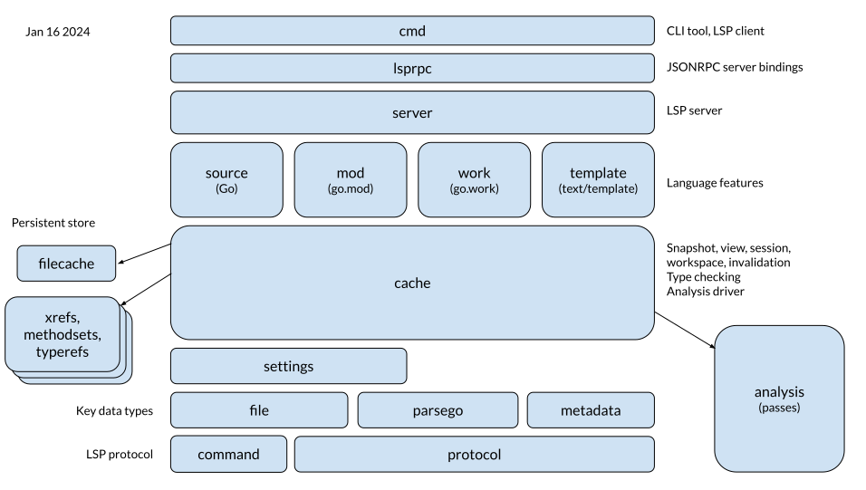

# Gopls architecture

Last major update: Jan 16 2024

This doc presents a high-level overview of the structure of gopls to
help new contributors find their way. It is not intended to be a
complete description of the implementation, nor even of any key
components; for that, the package documentation (linked below) and
other comments within the code are a better guide.

The diagram below shows selected components of the gopls module and
their relationship to each other according to the Go import graph.
Tests and test infrastructure are not shown, nor are utility packages,
nor packages from the [x/tools] module. For brevity, packages are
referred to by their last segment, which is usually unambiguous.

The height of each blob corresponds loosely to its technical depth.
Some blocks are wide and shallow, such as [protocol], which declares
Go types for the entire LSP protocol. Others are deep, such as [cache]
and [golang], as they contain a lot of dense logic and algorithms.

<!-- Source: https://docs.google.com/drawings/d/1CK6YSLt7G3svRoZf7skJI-lxRol2VI90YOxHcYS0DP4 -->

Starting from the bottom, we'll describe the various components.

The lowest layer defines the request and response types of the
Language Server Protocol:

- The [protocol] package defines the standard protocol; it is mostly
  generated mechanically from the schema definition provided by
  Microsoft.
  The most important type is DocumentURI, which represents a `file:`
  URL that identifies a client editor document. It also provides
  `Mapper`, which maps between the different coordinate systems used
  for source positions: UTF-8, UTF-16, and token.Pos.

- The [command] package defines Gopls's non-standard commands, which
  are all invoked through the `workspace/executeCommand` extension
  mechanism. These commands are typically returned by the server as
  continuations of Code Actions or Code Lenses; most clients do not
  construct calls to them directly.

The next layer defines a number of important and very widely used data structures:

- The [file] package defines the primary abstractions of a client
  file: its `Identity` (URI and content hash), and its `Handle` (which
  additionally provides the version and content of a particular
  snapshot of the file.

- The [parsego] package defines `File`, the parsed form of a Go source
  file, including its content, syntax tree, and coordinary mappings
  (Mapper and token.File). The package performs various kinds of tree
  repair to work around error-recovery shortcomings of the Go parser.

- The [metadata] package defines `Package`, an abstraction of the
  metadata of a Go package, similar to the output of `go list -json`.
  Metadata is produced from [go/packages], which takes
  care of invoking `go list`. (Users report that it works to some extent
  with a GOPACKAGESDRIVER for Bazel, though we maintain no tests for this
  scenario.)

  The package also provides `Graph`, the complete import graph for a
  workspace; each graph node is a `Package`.

The [settings] layer defines the data structure (effectively a large
tree) for gopls configuration options, along with its JSON encoding.

The [cache] layer is the largest and most complex component of gopls.
It is concerned with state management, dependency analysis, and invalidation:
the `Session` of communication with the client;
the `Folder`s that the client has opened;
the `View` of a particular workspace tree with particular build
options;
the `Snapshot` of the state of all files in the workspace after a
particular edit operation;
the contents of all files, whether saved to disk (`DiskFile`) or
edited and unsaved (`Overlay`);
the `Cache` of in-memory memoized computations,
such as parsing go.mod files or build the symbol index;
and the `Package`, which holds the results of type checking a package
from Go syntax.

The cache layer depends on various auxiliary packages, including:

- The [filecache] package, which manages gopls' persistent, transactional,
  file-based key/value store.
  
- The [xrefs], [methodsets], and [typerefs] packages define algorithms
  for constructing indexes of information derived from type-checking,
  and for encoding and decoding these serializable indexes in the file
  cache.

  Together these packages enable the fast restart, reduced memory
  consumption, and synergy across processes that were delivered by the
  v0.12 redesign and described in ["Scaling gopls for the growing Go
  ecosystem"](https://go.dev/blog/gopls-scalability).

The cache also defines gopls's [go/analysis] driver, which runs
modular analysis (similar to `go vet`) across the workspace.
Gopls also includes a number of analysis passes that are not part of vet.

The next layer defines four packages, each for handling files in a
particular language:
[mod] for go.mod files;
[work] for go.work files;
[template] for files in `text/template` syntax; and
[golang], for files in Go itself.
This package, by far the largest, provides the main features of gopls:
navigation, analysis, and refactoring of Go code.
As most users imagine it, this package _is_ gopls.

The [server] package defines the LSP service implementation, with one
handler method per LSP request type. Each handler switches on the type
of the file and dispatches to one of the four language-specific
packages.

The [lsprpc] package connects the service interface to our [JSON RPC](jsonrpc2)
server.

Bear in mind that the diagram is a dependency graph, a "static"
viewpoint of the program's structure. A more dynamic viewpoint would
order the packages based on the sequence in which they are encountered
during processing of a particular request; in such a view, the bottom
layer would represent the "wire" (protocol and command), the next
layer up would hold the RPC-related packages (lsprpc and server), and
features (e.g. golang, mod, work, template) would be at the top.

<!--
A dynamic view would be an interesting topic for another article.
This slide deck [requires Google network]
The Life of a (gopls) Query (Oct 2021)
https://docs.google.com/presentation/d/1c8XJaIldzii-F3YvEOPWHK_MQJ_o8ua5Bct1yDa3ZlU
provides useful (if somewhat out of date) information.
-->

The [cmd] package defines the command-line interface of the `gopls`
command, around which gopls's main package is just a trivial wrapper.
It is usually run without arguments, causing it to start a server and
listen indefinitely.
It also provides a number of subcommands that start a server, make a
single request to it, and exit, providing traditional batch-command
access to server functionality. These subcommands are primarily
provided as a debugging aid (but see
[#63693](https://github.com/golang/go/issues/63693)).

[cache]: https://pkg.go.dev/golang.org/x/tools/gopls@master/internal/cache
[cmd]: https://pkg.go.dev/golang.org/x/tools/gopls@master/internal/cmd
[command]: https://pkg.go.dev/golang.org/x/tools/gopls@master/internal/protocol/command
[debug]: https://pkg.go.dev/golang.org/x/tools/gopls@master/internal/debug
[file]: https://pkg.go.dev/golang.org/x/tools/gopls@master/internal/file
[filecache]: https://pkg.go.dev/golang.org/x/tools/gopls@master/internal/filecache
[go/analysis]: https://pkg.go.dev/golang.org/x/tools@master/go/analysis
[go/packages]: https://pkg.go.dev/golang.org/x/tools@master/go/packages
[gopls]: https://pkg.go.dev/golang.org/x/tools/gopls@master
[jsonrpc2]: https://pkg.go.dev/golang.org/x/tools@master/internal/jsonrpc2
[lsprpc]: https://pkg.go.dev/golang.org/x/tools/gopls@master/internal/lsprpc
[memoize]: https://github.com/golang/tools/tree/master/internal/memoize
[metadata]: https://pkg.go.dev/golang.org/x/tools/gopls@master/internal/cache/metadata
[methodsets]: https://pkg.go.dev/golang.org/x/tools/gopls@master/internal/cache/methodsets
[mod]: https://pkg.go.dev/golang.org/x/tools/gopls@master/internal/mod
[parsego]: https://pkg.go.dev/golang.org/x/tools/gopls@master/internal/cache/parsego
[protocol]: https://pkg.go.dev/golang.org/x/tools/gopls@master/internal/protocol
[server]: https://pkg.go.dev/golang.org/x/tools/gopls@master/internal/server
[settings]: https://pkg.go.dev/golang.org/x/tools/gopls@master/internal/settings
[golang]: https://pkg.go.dev/golang.org/x/tools/gopls@master/internal/golang
[template]: https://pkg.go.dev/golang.org/x/tools/gopls@master/internal/template
[typerefs]: https://pkg.go.dev/golang.org/x/tools/gopls@master/internal/cache/typerefs
[work]: https://pkg.go.dev/golang.org/x/tools/gopls@master/internal/work
[x/tools]: https://github.com/golang/tools@master
[xrefs]: https://pkg.go.dev/golang.org/x/tools/gopls@master/internal/cache/xrefs
