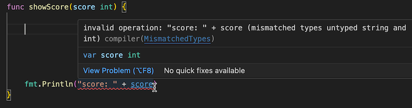
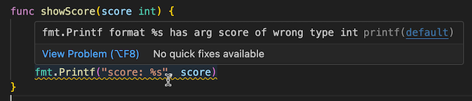

# Gopls: Diagnostics

Gopls continuously annotates all your open files of source code with a
variety of diagnostics. Every time you edit a file or make a
configuration change, gopls asynchronously recomputes these
diagnostics and sends them to the client using the LSP
[`publishDiagnostics`](https://microsoft.github.io/language-server-protocol/specifications/lsp/3.17/specification#textDocument_publishDiagnostics)
notification, giving you real-time feedback that reduces the cost of
common mistakes.

Diagnostics come from two main sources: compilation errors and analysis findings.

- **Compilation errors** are those that you would obtain from running `go
build`. Gopls doesn't actually run the compiler; that would be too
  slow. Instead it runs `go list` (when needed) to compute the
  metadata of the compilation, then processes those packages in a similar
  manner to the compiler front-end: reading, scanning, and parsing the
  source files, then type-checking them. Each of these steps can
  produce errors that gopls will surface as a diagnostic.

  The `source` field of the LSP `Diagnostic` record indicates where
  the diagnostic came from: those with source `"go list"` come from
  the `go list` command, and those with source `"compiler"` come from
  gopls' parsing or type checking phases, which are similar to those
  used in the Go compiler.

  

  The example above shows a `string + int` addition, causes the type
  checker to report a `MismatchedTypes` error. The diagnostic contains
  a link to the documentation about this class of type error.

- **Analysis findings** come from the [**Go analysis
  framework**](https://golang.org/x/tools/go/analysis), the system
  used by `go vet` to apply a variety of additional static checks to
  your Go code. The best-known example is the [`printf`
  analyzer](https://pkg.go.dev/golang.org/x/tools/go/analysis/passes/printf),
  which reports calls to [`fmt.Printf`](https://pkg.go.dev/fmt#Printf)
  where the format "verb" doesn't match the argument, such as
  `fmt.Printf("%d", "three")`.

  Gopls provides dozens of analyzers aggregated from a variety of
  suites; see [Analyzers](../analyzers.md) for the complete list. The
  `source` field of each diagnostic produced by an analyzer records
  the name of the analyzer that produced it.

  

  The example above shows a `printf` formatting mistake. The diagnostic contains
  a link to the documentation for the `printf` analyzer.

## Recomputation of diagnostics

By default, diagnostics are automatically recomputed each time the source files
are edited.

Compilation errors in open files are updated after a very short delay
(tens of milliseconds) after each file change, potentially after every keystroke.
This ensures rapid feedback of syntax and type errors while editing.

Compilation and analysis diagnostics for the whole workspace are much
more expensive to compute, so they are usually recomputed after a
short idle period (around 1s) following an edit.

The [`diagnosticsDelay`](../settings.md#diagnosticsDelay) setting determines
this period.
Alternatively, diagnostics may be triggered only after an edited file
is saved, using the
[`diagnosticsTrigger`](../settings.md#diagnosticsTrigger) setting.

When initialized with `"pullDiagnostics": true`, gopls also supports
["pull diagnostics"](https://microsoft.github.io/language-server-protocol/specifications/lsp/3.17/specification/#textDocument_pullDiagnostics),
an alternative mechanism for recomputing diagnostics in which the client
requests diagnostics from gopls explicitly using the `textDocument/diagnostic`
request. This feature is off by default until the performance of pull
diagnostics is comparable to push diagnostics.

## Quick fixes

Each analyzer diagnostic may suggest one or more alternative
ways to fix the problem by editing the code.
For example, when a `return` statement has too few operands,
the [`fillreturns`](../analyzers.md#fillreturns) analyzer
suggests a fix that heuristically fills in the missing ones
with suitable values. Applying the fix eliminates the compilation error.


The screenshot above shows VS Code's Quick Fix menu for an "unused
parameter" analysis diagnostic with two alternative fixes.
(See [Remove unused parameter](transformation.md#remove-unused-parameter) for more detail.)

Suggested fixes that are indisputably safe are [code
actions](transformation.md#code-actions) whose kind is
`"source.fixAll"`.
Many client editors have a shortcut to apply all such fixes.

<!-- Note: each Code Action has exactly one kind, so a server
     must offer each "safe" action twice, once with its usual kind
     and once with kind "source.fixAll".
     The only ones in gopls are simplify{compositelit,range,slice},
     which are fixAll + quickfix.
-->

TODO(adonovan): audit all the analyzers to ensure that their
documentation is up-to-date w.r.t. any fixes they suggest.

Settings:

- The [`diagnosticsDelay`](../settings.md#diagnosticsDelay) setting determines
  the idle period after an edit before diagnostics are recomputed.
- The [`diagnosticsTriggerr`](../settings.md#diagnosticsTrigger) setting determines
  what events cause recomputation of diagnostics.
- The [`linkTarget`](../settings.md#linkTarget) setting specifies
  the base URI for Go package links in the Diagnostic.CodeDescription field.

Client support:

- **VS Code**: Each diagnostic appears as a squiggly underline.
  Hovering reveals the details, along with any suggested fixes.
- **Emacs + eglot**: Each diagnostic appears as a squiggly underline.
  Hovering reveals the details. Use `M-x eglot-code-action-quickfix`
  to apply available fixes; it will prompt if there are more than one.
- **Vim + coc.nvim**: ??
- **CLI**: `gopls check file.go`

<!-- Below we list any quick fixes (by their internal fix name)
     that aren't analyzers. -->

### `stubMissingInterfaceMethods`: Declare missing methods of I

When a value of a concrete type is assigned to a variable of an
interface type, but the concrete type does not possess all the
necessary methods, the type checker will report a "missing method"
error.

In this situation, gopls offers a quick fix to add stub declarations
of all the missing methods to the concrete type so that it implements
the interface.

For example, this function will not compile because the value
`NegativeErr{}` does not implement the "error" interface:

```go
func sqrt(x float64) (float64, error) {
	if x < 0 {
		return 0, NegativeErr{} // error: missing method
	}
	...
}

type NegativeErr struct{}
```

Gopls will offer a quick fix to declare this method:

```go

// Error implements error.Error.
func (NegativeErr) Error() string {
	panic("unimplemented")
}
```

Beware that the new declarations appear alongside the concrete type,
which may be in a different file or even package from the cursor
position.
(Perhaps gopls should send a `showDocument` request to navigate the
client there, or a progress notification indicating that something
happened.)

### `StubMissingCalledFunction`: Declare missing method T.f

When you attempt to call a method on a type that does not have that method,
the compiler will report an error such as "type X has no field or method Y".
In this scenario, gopls now offers a quick fix to generate a stub declaration of
the missing method, inferring its type from the call.

Consider the following code where `Foo` does not have a method `bar`:

```go
type Foo struct{}

func main() {
  var s string
  f := Foo{}
  s = f.bar("str", 42) // error: f.bar undefined (type Foo has no field or method bar)
}
```

Gopls will offer a quick fix, "Declare missing method Foo.bar".
When invoked, it creates the following declaration:

```go
func (f Foo) bar(s string, i int) string {
	panic("unimplemented")
}
```

### `CreateUndeclared`: Create missing declaration for "undeclared name: X"

A Go compiler error "undeclared name: X" indicates that a variable or function is being used before
it has been declared in the current scope. In this scenario, gopls offers a quick fix to create the declaration.

#### Declare a new variable

When you reference a variable that hasn't been declared:

```go
func main() {
  x := 42
  min(x, y) // error: undefined: y
}
```

The quick fix would insert a declaration with a default
value inferring its type from the context:

```go
func main() {
  x := 42
  y := 0
  min(x, y)
}
```

#### Declare a new function

Similarly, if you call a function that hasn't been declared:

```go
func main() {
  var s string
  s = doSomething(42) // error: undefined: doSomething
}
```

Gopls will insert a new function declaration below,
inferring its type from the call:

```go
func main() {
  var s string
  s = doSomething(42)
}

func doSomething(i int) string {
  panic("unimplemented")
}
```
<!--

dorky details and deletia:

- The **vet suite**, of about thirty analyzers
  designed to catch likely mistakes in your code.

- **Type-error fixers**. These are gopls-specific analyzers that
  enrich diagnostics from the type checker by suggesting fixes for
  simple problems.

  For example, when a return statement has too few operands, the
  [fillreturns](https://pkg.go.dev/golang.org/x/tools/gopls/internal/analysis/fillreturns) analyzer can heuristically fill in the missing ones
  with suitable values.

  The actual diagnostics are produced by the type checker,
  so these analyzers won't cause you to see any new diagnostics;
  but they add fixes to existing ones.
  (The user needs to know this because the settings expose it.)

  currently: fillreturns nonewvars noresultvalues stubmethods undeclaredname unusedvariable

- **Simplifiers**. These are gopls-specific analyzers that
  suggest ways to rewrite your code more simply.
  They do not indicate a mistake in your code,
  which is why they are not part of `go vet`.

  For example, the `simplifyrange` analyzer will eliminate the
  unnecessary blank variable in `for _ = range v {...}`.

  currently: simplifycompositelit simplifyrange simplifyslice unusedparams infertypeargs

- **Bug detectors**. Gopls has a suite of bug-detecting analyzers that
    can't be part of vet for some reason. That might be because they
    have dependencies that vet cannot have (e.g. nilness and
    unusedwrite, which construct SSA), or because they are tightly
    integrated with gopls (e.g. embeddirective, which produces lazy
    fixes through the code action mechanism
    [But others do that too:  undeclaredname embeddirective unusedparams stubmethods]

  currently: atomicalign deepequalerrors nilness sortslice unusedwrite embeddirective

- **staticcheck**: four suites:

	add(simple.Analyzers, nil)
	add(staticcheck.Analyzers - SA5009, SA5011
	add(stylecheck.Analyzers, nil)
	add(quickfix.Analyzers, nil)

- **Experimental analyzers**. Gopls has some analyzers that are not
  enabled by default, because they produce too high a rate of false
  positives. For example, fieldalignment, shadow, useany.

Note: fillstruct is not a real analyzer.

-->
