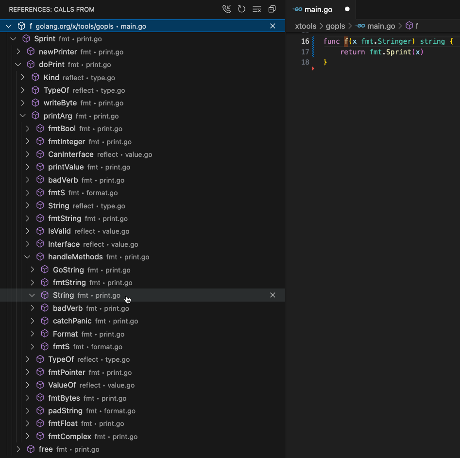

# Gopls: Navigation features

This page documents gopls features for navigating your source code.

<!-- TODO: screenshots -->

## Definition

The LSP [`textDocument/definition`](https://microsoft.github.io/language-server-protocol/specifications/lsp/3.17/specification/#textDocument_definition)
request returns the location of the declaration of the symbol under the cursor.
Most editors provide a command to navigate directly to that location.

A definition query also works in these unexpected places:

- On an **import path**, it returns the list of locations, of
  each package declaration in the files of the imported package.
- On a **package declaration**, it returns the location of
  the package declaration that provides the documentation of that package.
- On a symbol in a **[`go:linkname` directive](https://pkg.go.dev/cmd/compile)**,
  it returns the location of that symbol's declaration.
- On a **[doc link](https://tip.golang.org/doc/comment#doclinks)**, it returns
  (like [`hover`](passive.md#hover)) the location of the linked symbol.
- On a file name in a **[`go:embed` directive](https://pkg.go.dev/embed)**,
  it returns the location of the embedded file.
- On the declaration of a non-Go function (a `func` with no body),
  it returns the location of the assembly implementation, if any,
- On a **return statement**, it returns the location of the function's result variables.
- On a **goto**, **break**, or **continue** statement, it returns the
  location of the label, the closing brace of the relevant block statement, or the
  start of the relevant loop, respectively.

<!-- On a built-in symbol such as `append` or `unsafe.Pointer`, `definition` reports
the location of the declaration in the builtin or unsafe pseudo-packages,
which are just documentation. -->

Client support:
- **VS Code**: Use [Go to Definition](https://code.visualstudio.com/docs/editor/editingevolved#_go-to-definition) (`F12` or `⌘`-click).
  If the cursor is already at the declaration, the request is instead interpreted as "Go to References".
- **Emacs + eglot**: use [`M-x xref-find-definitions`](https://www.gnu.org/software/emacs/manual/html_node/emacs/Xref.html).
- **Vim + coc.nvim**: ??
- **CLI**: `gopls definition file.go:#offset`

## References

The LSP [`textDocument/references`](https://microsoft.github.io/language-server-protocol/specifications/lsp/3.17/specification/#textDocument_references)
request returns the locations of all identifiers that refer to the symbol under the cursor.

The references algorithm handles various parts of syntax as follows:

- The references to a **symbol** report all uses of that symbol.
  In the case of exported symbols this may include locations in other packages.
- The references to a **package declaration** are all the
  direct imports of the package, along with all the other package
  declarations in the same package.
- It is an error to request the references to a **built-in symbol**
  such as `int` or `append`,
  as they are presumed too numerous to be of interest.
- The references to an **interface method** include references to
  concrete types that implement the interface. Similarly, the
  references to a **method of a concrete type** include references to
  corresponding interface methods.
- An **embedded field** `T` in a struct type such as `struct{T}` is
  unique in Go in that it is both a reference (to a type) and a
  definition (of a field).
  The `references` operation reports only the references to it [as a field](golang/go#63521).
  To find references to the type, jump to the type declararation first.

Be aware that a references query returns information only about the
build configuration used to analyze the selected file, so if you ask
for the references to a symbol defined in `foo_windows.go`, the result
will never include the file `bar_linux.go`, even if that file refers
to a symbol of the same name; see golang/go#65755.

Clients can request that the the declaration be included among the
references; most do.

Client support:
- **VS Code**: Use [`Go to References`](https://code.visualstudio.com/docs/editor/editingevolved#_peek) to quickly "peek" at the references,
  or `Find all References` to open the references panel.
- **Emacs + eglot**: Via [`xref` package](https://www.gnu.org/software/emacs/manual/html_node/emacs/Xref.html): use `M-x xref-find-references`.
- **Vim + coc.nvim**: ??
- **CLI**: `gopls references file.go:#offset`

## Implementation

The LSP
[`textDocument/implementation`](https://microsoft.github.io/language-server-protocol/specifications/lsp/3.17/specification/#textDocument_implementation)
request queries the "implements" relation between interfaces and concrete types:

- When invoked on a reference to an **interface type**, it returns the
  location of the declaration of each type that implements
  the interface.
- When invoked on a **concrete type**,
  it returns the locations of the matching interface types. 
- When invoked on an **interface method**, it returns the corresponding
  methods of the types that satisfy the interface.
- When invoked on a **concrete method**,
  it returns the locations of the matching interface methods.

Only non-trivial interfaces are considered; no implementations are
reported for type `any`.

Within the same package, all matching types/methods are reported.
However, across packages, only exported package-level types and their
methods are reported, so local types (whether interfaces, or struct
types with methods due to embedding) may be missing from the results.
<!-- Reason: assignability of local types such as I and J defined thus:
     package p; func P() {type I interface {...}}
     package q; func Q() {type J struct {...}}
     depends on them both being in the same types.Importer "realm",
     but that is not consistent with the "scalable" gopls design.
-->

If either the target type or the candidate type are generic, the
results will include the candidate type if there is any instantiation
of the two types that would allow one to implement the other.
(Note: the matcher doesn't current implement full unification, so type
parameters are treated like wildcards that may match arbitrary
types, without regard to consistency of substitutions across the
method set or even within a single method.
This may lead to occasional spurious matches.)

Client support:
- **VS Code**: Use [Go to Implementations](https://code.visualstudio.com/docs/editor/editingevolved#_go-to-implementation) (`⌘F12`).
- **Emacs + eglot**: Use `M-x eglot-find-implementation`.
- **Vim + coc.nvim**: ??
- **CLI**: `gopls implementation file.go:#offset`

## Type Definition

The LSP
[`textDocument/typeDefinition`](https://microsoft.github.io/language-server-protocol/specifications/lsp/3.17/specification/#textDocument_typeDefinition)
request returns the location of the type of the selected symbol.

For example, if the selection is the name `buf` of a local variable of
type `*bytes.Buffer`, a `typeDefinition` query will return the
location of the type `bytes.Buffer`.
Clients typically navigate to that location.

Type constructors such as pointer, array, slice, channel, and map are
stripped off the selected type in the search for a named type. For
example, if x is of type `chan []*T`, the reported type definition
will be that of `T`.
Similarly, if the symbol's type is a function with one "interesting"
(named, non-`error`) result type, the function's result type is used.

Gopls currently requires that a `typeDefinition` query be applied to a
symbol, not to an arbitrary expression; see golang/go#67890 for
potential extensions of this functionality.
<!-- e.g. selecting a struct field, package name, or other piece of syntax. -->

Client support:
- **VS Code**: Use [Go to Type Definition](https://code.visualstudio.com/docs/editor/editingevolved#_go-to-implementation).
- **Emacs + eglot**: Use `M-x eglot-find-typeDefinition`.
- **Vim + coc.nvim**: ??
- **CLI**: not supported

## Document Symbol

The `textDocument/documentSymbol` LSP query reports the list of
top-level declarations in this file. Clients may use this information
to present an overview of the file, and an index for faster navigation.

Gopls responds with the
[`DocumentSymbol`](https://microsoft.github.io/language-server-protocol/specifications/lsp/3.17/specification#documentSymbol)
type if the client indicates
[`hierarchicalDocumentSymbolSupport`](https://microsoft.github.io/language-server-protocol/specifications/lsp/3.17/specification#documentSymbolClientCapabilities);
otherwise it returns a
[`SymbolInformation`](https://microsoft.github.io/language-server-protocol/specifications/lsp/3.17/specification#symbolInformation).

Client support:
- **VS Code**: Use the [Outline view](https://code.visualstudio.com/docs/getstarted/userinterface#_outline-view) for navigation.
- **Emacs + eglot**: Use [`M-x imenu`](https://www.gnu.org/software/emacs/manual/html_node/emacs/Imenu.html#Imenu) to jump to a symbol.
- **Vim + coc.nvim**: ??
- **CLI**: `gopls links file.go`

## Symbol

The
[`workspace/symbol`](https://microsoft.github.io/language-server-protocol/specifications/lsp/3.17/specification#workspace_symbol)
LSP query searches an index of all the symbols in the workspace.

The default symbol matching algorithm (`fastFuzzy`), inspired by the
popular fuzzy matcher [FZF](https://github.com/junegunn/fzf), attempts
a variety of inexact matches to correct for misspellings or abbreviations in your
query. For example, it considers `DocSym` a match for `DocumentSymbol`.

<!--
It also supports the following special characters within queries:

| Character | Usage     | Match        |
| --------- | --------- | ------------ |
| `'`       | `'abc`    | exact        |
| `^`       | `^printf` | exact prefix |
| `$`       | `printf$` | exact suffix |

However, VS Code does its own fuzzy matching afterward, so these
aren't effective in that client; see golang/vscode-go#647.
-->

Settings:
- The [`symbolMatcher`](../settings.md#symbolMatcher) setting controls the algorithm used for symbol matching.
- The [`symbolStyle`](../settings.md#symbolStyle) setting controls how symbols are qualified in symbol responses.
- The [`symbolScope`](../settings.md#symbolScope) setting determines the scope of the query.
- The [`directoryFilters`](../settings.md#directoryFilters) setting specifies directories to be excluded from the search.

Client support:
- **VS Code**: Use ⌘T to open [Go to Symbol](https://code.visualstudio.com/docs/editor/editingevolved#_go-to-symbol) with workspace scope.  (Alternatively, use Ctrl-Shift-O, and add a `@` prefix to search within the file or a `#` prefix to search throughout the workspace.)
- **Emacs + eglot**: Use [`M-x xref-find-apropos`](https://www.gnu.org/software/emacs/manual/html_node/emacs/Looking-Up-Identifiers.html) to show symbols that match a search term.
- **Vim + coc.nvim**: ??
- **CLI**: `gopls links file.go`

## Selection Range

The
[`textDocument/selectionRange`](https://microsoft.github.io/language-server-protocol/specifications/lsp/3.17/specification#textDocument_selectionRange)
LSP query returns information about the lexical extent of each piece
of syntax enclosing the current selection.
Clients may use it to provide an operation to expand the selection
to successively larger expressions.

Client support:
- **VSCode**: Use `⌘⇧^→` to expand the selection or `⌘⇧^←` to contract it again; watch this [video](https://www.youtube.com/watch?v=dO4SGAMl7uQ).
- **Emacs + eglot**: Not standard. Use `M-x eglot-expand-selection` defined in [this configuration snippet](https://github.com/joaotavora/eglot/discussions/1220#discussioncomment-9321061).
- **Vim + coc.nvim**: ??
- **CLI**: not supported

## Call Hierarchy

The LSP CallHierarchy mechanism consists of three queries that
together enable clients to present a hierarchical view of a portion of
the static call graph:

- [`textDocument/prepareCallHierarchy`](https://microsoft.github.io/language-server-protocol/specifications/lsp/3.17/specification#textDocument_prepareCallHierarchy) returns a list of [items](https://microsoft.github.io/language-server-protocol/specifications/lsp/3.17/specification#callHierarchyItem) for a given position, each representing a named function or method enclosing the position;
- [`callHierarchyItem/incomingCalls`](https://microsoft.github.io/language-server-protocol/specifications/lsp/3.17/specification#callHierarchy_incomingCalls) returns the set of call sites that call the selected item; and
- [`callHierarchy/outgoingCalls`](https://microsoft.github.io/language-server-protocol/specifications/lsp/3.17/specification#callHierarchy_incomingCalls) returns the set of functions called by the selected item.

Invoke the command while selecting the name in a function declaration.

Dynamic calls are not included, because it is not analytically
practical to detect them. So, beware that the results may not be
exhaustive, and perform a [References](#references) query if necessary.

The hierarchy does not consider a nested function distinct from its
enclosing named function. (Without the ability to detect dynamic
calls, it would make little sense do so.)

The screenshot below shows the outgoing call tree rooted at `f`. The
tree has been expanded to show a path from `f` to the `String` method
of `fmt.Stringer` through the guts of `fmt.Sprint:`

Caveats:
- In some cases dynamic function calls are (erroneously) included in
  the output; see golang/go#68153.

Client support:
- **VS Code**: `Show Call Hierarchy` menu item (`⌥⇧H`) opens [Call hierarchy view](https://code.visualstudio.com/docs/cpp/cpp-ide#_call-hierarchy) (note: docs refer to C++ but the idea is the same for Go).
- **Emacs + eglot**: Not standard; install with `(package-vc-install "https://github.com/dolmens/eglot-hierarchy")`. Use `M-x eglot-hierarchy-call-hierarchy` to show the direct incoming calls to the selected function; use a prefix argument (`C-u`) to show the direct outgoing calls. There is no way to expand the tree.
- **CLI**: `gopls call_hierarchy file.go:#offset` shows outgoing and incoming calls.
