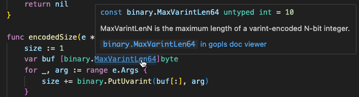
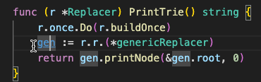

# Gopls: Passive features

This page documents the fundamental LSP features of gopls that may be
described as "passive", since many editors use them to continuously
provide information about your source files without requiring any
special action.

See also [Code Lenses](../codelenses.md), some of which annotate your
source code with additional information and may thus also be
considered passive features.


## Hover

The LSP [`textDocument/hover`](https://microsoft.github.io/language-server-protocol/specifications/lsp/3.17/specification/#textDocument_hover)
query returns a	description of the code currently under the cursor, such
as its name, kind, type, value (for a constant), abbreviated
declaration (for a type), doc comment (if any), and a link to the
symbol's documentation on `pkg.go.dev`. The client may request either
plain text or Markdown.



Depending on the selection, the response may include additional information.
For example, hovering over a type shows its declared methods,
plus any methods promoted from embedded fields.

**Doc links**: A doc comment may refer to another symbol using square
brackets, for example `[fmt.Printf]`. Hovering over one of these
[doc links](https://go.dev/doc/comment#doclinks) reveals
information about the referenced symbol.


**Struct size/offset info**: for declarations of struct types,
hovering over the name reveals the struct's size in bytes:


And hovering over each field name shows the size and offset of that field:


This information may be useful when optimizing the layout of your data
structures, or when reading assembly files or stack traces that refer
to each field by its cryptic byte offset.

In addition, Hover reports the percentage of wasted space due to
suboptimal ordering of struct fields, if this figure is 20% or higher:


In the struct above, alignment rules require each of the two boolean
fields (1 byte) to occupy a complete word (8 bytes), leading to (7 +
7) / (3 * 8) = 58% waste.
Placing the two booleans together would save a word.
(In most structures clarity is more important than compactness, so you
should reorder fields to save space only in data structures that have
been shown by profiling to be very frequently allocated.)

**Embed directives**: hovering over the file name pattern in
[`//go:embed` directive](https://pkg.go.dev/embed), for example
`*.html`, reveals the list of file names to which the wildcard
expands.


<!-- NB: Emacs+eglot displays only the first line of markdown, not the useful part! -->

**Linkname directives**: a [`//go:linkname` directive](https://pkg.go.dev/cmd/compile#hdr-Compiler_Directives) creates a linker-level alias for another symbol.
Hovering over the directive shows information about the other symbol.


The hover information for symbols from the standard library added
after Go 1.0 states the Go release that added the symbol.

Settings:
- The [`hoverKind`](../settings.md#hoverKind) setting controls the verbosity of documentation.
- The [`linkTarget`](../settings.md#linkTarget) setting specifies
  the base URI for Go package links

Caveats:
- It is an unfortunate limitation of the LSP that a `Hover` request
  currently includes only a position but not a selection, as this
  means it is impossible to request information about the type and
  methods of, say, the `f(x)` portion of the larger expression
  `f(x).y`. Please upvote microsoft/language-server-protocol#1466 if
  you would like to see this addressed.

Client support:
- **VS Code**: enabled by default. Displays rendered Markdown in a panel near the cursor.
- **Emacs + eglot**: enabled by default. Displays a one-line summary in the echo area.
- **Vim + coc.nvim**: ??
- **CLI**: `gopls definition file.go:#start-#end` includes information from a Hover query.


## Signature Help

The LSP [`textDocument/signatureHelp`](https://microsoft.github.io/language-server-protocol/specifications/lsp/3.17/specification/#textDocument_signatureHelp)
query returns information about the innermost function call enclosing
the cursor or selection, including the signature of the function and
the names, types, and documentation of each parameter.

Clients may provide this information to help remind the user of the
purpose of each parameter and their order, while reading or editing a
function call.


Call parens are not necessary if the cursor is within an identifier
that denotes a function or method. For example, Signature Help at
`once.Do(initialize‸)` will describe `initialize`, not `once.Do`.

Client support:
- **VS Code**: enabled by default.
  Also known as "[parameter hints](https://code.visualstudio.com/api/references/vscode-api#SignatureHelpProvider)" in the [IntelliSense settings](https://code.visualstudio.com/docs/editor/intellisense#_settings).
  Displays signature and doc comment alongside Hover information.
- **Emacs + eglot**: enabled by default. Displays signature in the echo area.
- **Vim + coc.nvim**: ??
- **CLI**: `gopls signature file.go:#start-#end`


## Document Highlight

The LSP [`textDocument/documentHighlight`](https://microsoft.github.io/language-server-protocol/specifications/lsp/3.17/specification/#textDocument_documentHighlight)
query reports a set of source ranges that should be highlighted based
on the current cursor position or selection, to emphasize the
relationship between them.

Each of the following parts of syntax forms a set so that if you
select any one member, gopls will highlight the complete set:

- each identifier that refers to the same symbol (as in the screenshot below);
- a named result variable and all its corresponding operands of `return` statements;
- the `for`, `break`, and `continue` tokens of the same loop;
- the `switch` and `break` tokens of the same switch statement;
- the `func` keyword of a function and all of its `return` statements.

More than one of these rules may be activated by a single selection,
for example, by an identifier that is also a return operand.

Different occurrences of the same identifier may be color-coded to distinguish
"read" from "write" references to a given variable symbol.



Client support:
- **VS Code**: enabled by default. Triggered by cursor motion, or single click.
  (Note: double clicking activates a simple syntax-oblivious textual match.)
- **Emacs + eglot**: enabled by default. Triggered by cursor motion or selection.
- **Vim + coc.nvim**: ??
- **CLI**: `gopls signature file.go:#start-#end`


## Inlay Hint

The LSP [`textDocument/inlayHint`](https://microsoft.github.io/language-server-protocol/specifications/lsp/3.17/specification/#textDocument_inlayHint)
query returns a set of annotations to be spliced into the current file
that reveal implicit information.


Examples:

- In a function call `f(1, 2)`, hints provide the
  names of the parameters (`parameterNames`), as in the screenshot above.
- In a call to a generic function, hints provide the type arguments
  (`functionTypeParameters`).
- In an assignment `x, y = 1, 2`, hints provide the types of the
  variables (`assignVariableTypes`).
- In a struct literal such as `Point2D{1, 2}`, hints provide the field
  names (`compositeLiteralFields`).
- In a nested composite literal `T{{...}}`, a hint provides the type of
  the inner literal, `{...}` (`compositeLiteralTypes`).
- In a `for k, v := range x {}` loop, hints provide the types of the
  variables k and v (`rangeVariableTypes`).
- For a constant expression (perhaps using `iota`), a hint provides
  its computed value (`constantValues`).

See [Inlay hints](../inlayHints.md) for a complete list with examples.

<!--
TODO: Do we really need that separate doc? We could put all the
     information here with much less fuss. It changes so rarely that a
     culture of "update the tests and docs in every CL" should be sufficient.
     IIUC, VS Code needs only the api-json representation.
-->

Settings:
- The [`hints`](../settings.md#hints) setting indicates the desired set of hints.
  To reduce distractions, its default value is empty.
  To enable hints, add one or more of the identifiers above to the hints
  map. For example:
  ```json5
  "hints": {"parameterNames": true}
  ```

Client  support:
- **VS Code**: in addition to the `hints` configuration value, VS Code provides a graphical
  configuration menu ("Preferences: Open Settings (UI)" the search for "Go Inlay Hints")
  for each supported kind of inlay hint.
- **Emacs + eglot**: disabled by default. Needs `M-x eglot-inlay-hints-mode` plus the configuration [described here](https://www.reddit.com/r/emacs/comments/11bqzvk/emacs29_and_eglot_inlay_hints/)
- **Vim + coc.nvim**: ??
- **CLI**: not supported

## Semantic Tokens

The LSP [`textDocument/semanticTokens`](https://microsoft.github.io/language-server-protocol/specifications/lsp/3.17/specification/#textDocument_semanticTokens)
query reports information about all the tokens in the current file, or
a portion of it.
The client may use this information to provide syntax highlighting
that conveys semantic distinctions between, for example, functions and
types, constants and variables, or library functions and built-ins.

The client must specify the sets of types and modifiers it is interested in.

Gopls reports the following token types:

- `"comment"`: a comment
- `"function"`: a function
- `"keyword"`: a keyword
- `"label"`: a control label (not an LSP standard type)
- `"macro"`: text/template tokens
- `"method"`: a method
- `"namespace"`: an imported package name
- `"number"`: a numeric literal
- `"operator"`: an operator
- `"parameter"`: a parameter variable
- `"string"`:  a string literal
- `"type"`: a type name (plus other uses)
- `"typeParameter"`: a type parameter
- `"variable"`: a var or const (see `readonly` modifier)

Gopls also reports the following standard modifiers:

- `"defaultLibrary"`: predeclared symbols
- `"definition"`: the declaring identifier of a symbol
- `"readonly"`: for constants

plus these non-standard modifiers each representing the top-level
constructor of each symbols's type:

- `"array"`
- `"bool"`
- `"chan"`
- `"interface"`
- `"map"`
- `"number"`
- `"pointer"`
- `"signature"`
- `"slice"`
- `"string"`
- `"struct"`

Settings:
- The [`semanticTokens`](../settings.md#semanticTokens) setting determines whether
  gopls responds to semantic token requests. This option allows users to disable
  semantic tokens even when their client provides no client-side control over the
  feature. Because gopls' semantic-tokens algorithm depends on type checking,
  which adds a tangible latency, this feature is currently disabled by default
  to avoid any delay in syntax highlighting; see golang/go#45313, golang/go#47465.
- The experimental [`noSemanticString`](../settings.md#noSemanticString) and
  [`noSemanticNumber`](../settings.md#noSemanticNumber) settings cause the server
  to exclude the `string` and `number` kinds from the response, as some clients
  may do a more colorful job highlighting these tokens; see golang/go#45753.

Client Support:
- **VS Code**: See [Semantic Highlighting Guide](https://code.visualstudio.com/api/language-extensions/semantic-highlight-guide).
- **Emacs + eglot**: Not supported; see joaotavora/eglot#615.
- **Vim + coc.nvim**: ??
- **CLI**: `gopls semtok file.go`

For internal details of gopls' implementation of semantic tokens,
see [semantic tokens](../semantictokens.md).

## Folding Range

The LSP [`textDocument/foldingRange`](https://microsoft.github.io/language-server-protocol/specifications/lsp/3.17/specification/#textDocument_foldingRange)
query reports the list of regions in the current file that may be
independently collapsed or expanded. For example, it may be convenient
to collapse large comments or functions when studying some code so
that more of it fits in a single screen.


The protocol [allows](https://microsoft.github.io/language-server-protocol/specifications/lsp/3.17/specification/#foldingRangeClientCapabilities) clients to indicate whether they prefer
fine-grained ranges such as matched pairs of brackets, or only ranges
consisting of complete lines.

Client support:
- **VS Code**: displayed in left margin. Toggle the chevrons (`∨` and `>`) to collapse or expand.
- **Emacs + eglot**: not supported.
- **Vim + coc.nvim**: ??
- **CLI**: `gopls folding_ranges file.go`

## Document Link

The LSP [`textDocument/documentLink`](https://microsoft.github.io/language-server-protocol/specifications/lsp/3.17/specification/#textDocument_documentLink)
query uses heuristics to extracts URLs from doc comments and string
literals in the current file so that the client can present them as
clickable links.


In addition to explicit URLs, gopls also turns string literals in
import declarations into links to the pkg.go.dev documentation for the
imported package.

Settings:
- The [`importShortcut`](../settings.md#importShortcut) setting determines
  what kind of link is returned for an `import` declaration.
- The [`linkTarget`](../settings.md#linkTarget) setting specifies
  the base URI for Go package links.

Client support:
- **VS Code**: Hovering over a link displays a "Follow link (cmd+click)" popup.
- **Emacs + eglot**: not currently used.
- **Vim + coc.nvim**: ??
- **CLI**: `gopls links file.go`
