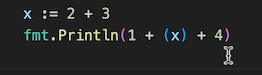

# Gopls: Code transformation features

This document describes gopls' features for code transformation, which
include a range of behavior-preserving changes (refactorings,
formatting, simplifications), code repair (fixes), and editing support
(filling in struct literals and switch statements).

Code transformations are not a single category in the LSP:
- A few, such as Formatting and Rename, are primary operations in the
  protocol.
- Some transformations are exposed through [Code Lenses](../codelenses.md),
  which return _commands_, arbitrary server
  operations invoked for their side effects through a
  [`workspace/executeCommand`](https://microsoft.github.io/language-server-protocol/specifications/lsp/3.17/specification/#workspace_executeCommand) request;
  however, no current code lenses are transformations of Go syntax.
  <!-- Generate, RegenerateCgo (Go); Tidy, UpgradeDependency, Vendor (go.mod) -->
- Most transformations are defined as *code actions*.

## Code Actions

A **code action** is an action associated with a portion of the file.
Each time the selection changes, a typical client makes a
[`textDocument/codeAction`](https://microsoft.github.io/language-server-protocol/specifications/lsp/3.17/specification/#textDocument_codeAction)
request for the set of available actions, then updates its UI
elements (menus, icons, tooltips) to reflect them.
The VS Code manual describes code actions as
"[Quick fixes + Refactorings](https://code.visualstudio.com/docs/editor/refactoring#_code-actions-quick-fixes-and-refactorings)".

A `codeAction` request delivers the menu, so to speak, but it does
not order the meal. Once the user chooses an action, one of two things happens.
In trivial cases, the action itself contains an edit that the
client can directly apply to the file.
But in most cases the action contains a command,
similar to the command associated with a code lens.
This allows the work of computing the patch to be done lazily, only
when actually needed. (Most aren't.)
The server may then compute the edit and send the client a
[`workspace/applyEdit`](https://microsoft.github.io/language-server-protocol/specifications/lsp/3.17/specification/#workspace_applyEdit)
request to patch the files.
Not all code actions' commands have an `applyEdit` side effect: some
may change the state of the server, for example to toggle a variable
or to cause the server to send other requests to the client,
such as a `showDocument` request to open a report in a web browser.

The main difference between code lenses and code actions is this:
- a `codeLens` request obtains commands for the entire file.
  Each command specifies its applicable source range,
  and typically appears as an annotation on that source range.
- a `codeAction` request obtains commands only for a particular range: the current selection.
  All the commands are presented together in a menu at that location.

Each action has a _kind_,
which is a hierarchical identifier such as `refactor.inline.call`.
Clients may filter actions based on their kind.
For example, VS Code has:
two menus, "Refactor..." and "Source action...", each populated by
different kinds of code actions (`refactor` and `source`);
a lightbulb icon that triggers a menu of "quick fixes" (of kind `quickfix`);
and a "Fix All" command that executes all code actions of
kind `source.fixAll`, which are those deemed unambiguously safe to apply.

Gopls supports the following code actions:

- `quickfix`, which applies unambiguously safe fixes <!-- TODO: document -->
- [`source.organizeImports`](#source.organizeImports)
- [`source.assembly`](web.md#assembly)
- [`source.doc`](web.md#doc)
- [`source.freesymbols`](web.md#freesymbols)
- `source.test` (undocumented) <!-- TODO: fix that -->
- [`source.addTest`](#source.addTest)
- [`gopls.doc.features`](README.md), which opens gopls' index of features in a browser
- [`refactor.extract.constant`](#extract)
- [`refactor.extract.function`](#extract)
- [`refactor.extract.method`](#extract)
- [`refactor.extract.toNewFile`](#extract.toNewFile)
- [`refactor.extract.variable`](#extract)
- [`refactor.inline.call`](#refactor.inline.call)
- [`refactor.rewrite.changeQuote`](#refactor.rewrite.changeQuote)
- [`refactor.rewrite.fillStruct`](#refactor.rewrite.fillStruct)
- [`refactor.rewrite.fillSwitch`](#refactor.rewrite.fillSwitch)
- [`refactor.rewrite.invertIf`](#refactor.rewrite.invertIf)
- [`refactor.rewrite.joinLines`](#refactor.rewrite.joinLines)
- [`refactor.rewrite.removeUnusedParam`](#refactor.rewrite.removeUnusedParam)
- [`refactor.rewrite.splitLines`](#refactor.rewrite.splitLines)

Gopls reports some code actions twice, with two different kinds, so
that they appear in multiple UI elements: simplifications,
for example from `for _ = range m` to `for range m`,
have kinds `quickfix` and `source.fixAll`,
so they appear in the "Quick Fix" menu and
are activated by the "Fix All" command.

<!-- In principle the filter may include the trigger event
     e.g. auto (cursor motion) vs. invoked (open a menu)
     but gopls currently ignores it. -->

Many transformations are computed by [analyzers](../analyzers.md)
that, in the course of reporting a diagnostic about a problem,
also suggest a fix.
A `codeActions` request will return any fixes accompanying diagnostics
for the current selection.
<!-- Some gopls-internal analyzers compute fixes lazily by
     reporting an empty list of TextEdits and a Diagnostic.Category
     recognized by gopls that enables corresponding logic in the
     server's ApplyFix command handler. -->

<!-- The source.test ("Run this test") code action (not a
     transformation) runs the selected test. However, it is not
     offered by default because:
     (a) VS Code has a richer test UX (with richer ones to come--see
         https://github.com/golang/vscode-go/issues/1641) and
     (b) LSP has no good way to display the streaming output of a test
         in the client's natural UX (see last paragraph of first note
	 of https://github.com/golang/go/issues/67400).
     It is only offered when the "only" field includes kind source.test.
     Should it be documented? If so, where?
-->

Caveats:
- Many of gopls code transformations are limited by Go's syntax tree
  representation, which currently records comments not in the tree
  but in a side table; consequently, transformations such as Extract
  and Inline are prone to losing comments. This is issue
  golang/go#20744, and it is a priority for us to fix in 2024.

- Generated files, as identified by the conventional
  [DO NOT EDIT](https://go.dev/s/generatedcode) comment,
  are not offered code actions for transformations.
  <!-- TODO: this is frankly a nuisance. It is often convenient to modify generated files -->

Client support for code actions:

- **VS Code**: Depending on their kind, code actions are found in
  the "Refactor..." menu (`^⇧R`),
  the "Source action..." menu,
  the 💡 (light bulb) icon's menu, or
  the "Quick fix" (`⌘.`) menu.
  The "Fix All" command applies all actions of kind `source.fixAll`.
- **Emacs + eglot**: Code actions are invisible.
  Use `M-x eglot-code-actions` to select one from those that are
  available (if there are multiple) and execute it.
  Some action kinds have filtering shortcuts,
  e.g. [`M-x eglot-code-action-{inline,extract,rewrite}`](https://joaotavora.github.io/eglot/#index-M_002dx-eglot_002dcode_002daction_002dinline).
- **CLI**: `gopls codeaction -exec -kind k,... -diff file.go:#123-#456` executes code actions of the specified
  kinds (e.g. `refactor.inline`) on the selected range, specified using zero-based byte offsets, and displays the diff.

<a name='formatting'></a>
## Formatting

The LSP
[`textDocument/formatting`](https://microsoft.github.io/language-server-protocol/specifications/lsp/3.17/specification/#textDocument_formatting)
request returns edits that format a file.
Gopls applies Go's canonical formatting algorithm,
[`go fmt`](https://pkg.go.dev/cmd/gofmt).
LSP formatting options are ignored.

Most clients are configured to format files and organize imports
whenever a file is saved.

Settings:
- The [`gofumpt`](../settings.md#gofumpt) setting causes gopls to use an
  alternative formatter, [`github.com/mvdan/gofumpt`](https://pkg.go.dev/mvdan.cc/gofumpt).

Client support:
- **VS Code**: Formats on save by default. Use `Format document` menu item (`⌥⇧F`) to invoke manually.
- **Emacs + eglot**: Use `M-x eglot-format-buffer` to format. Attach it to `before-save-hook` to format on save. For formatting combined with organize-imports, many users take the legacy approach of setting `"goimports"` as their `gofmt-command` using [go-mode](https://github.com/dominikh/go-mode.el), and adding `gofmt-before-save` to `before-save-hook`. An LSP-based solution requires code such as https://github.com/joaotavora/eglot/discussions/1409.
- **CLI**: `gopls format file.go`

<a name='source.organizeImports'></a>
## `source.organizeImports`: Organize imports

A `codeActions` request in a file whose imports are not organized will
return an action of the standard kind `source.organizeImports`.
Its command has the effect of organizing the imports:
deleting existing imports that are duplicate or unused,
adding new ones for undefined symbols,
and sorting them into the conventional order.

The addition of new imports is based on heuristics that depend on
your workspace and the contents of your GOMODCACHE directory; they may
sometimes make surprising choices.

Many editors automatically organize imports and format the code before
saving any edited file.

Some users dislike the automatic removal of imports that are
unreferenced because, for example, the sole line that refers to the
import is temporarily commented out for debugging; see golang/go#54362.

Settings:

- The [`local`](../settings.md#local) setting is a comma-separated list of
  prefixes of import paths that are "local" to the current file and
  should appear after standard and third-party packages in the sort order.

Client support:
- **VS Code**: automatically invokes `source.organizeImports` before save.
  To disable it, use the snippet below, and invoke the "Organize Imports" command manually as needed.
  ```
  "[go]": {
    "editor.codeActionsOnSave": { "source.organizeImports": false }
  }
  ```
- **Emacs + eglot**: Use `M-x eglot-code-action-organize-imports` to invoke manually.
  Many users of [go-mode](https://github.com/dominikh/go-mode.el) use these lines to
  organize imports and reformat each modified file before saving it, but this
  approach is based on the legacy
  [`goimports`](https://pkg.go.dev/golang.org/x/tools/cmd/goimports) tool, not gopls:
  ```lisp
  (setq gofmt-command "goimports")
  (add-hook 'before-save-hook 'gofmt-before-save)
  ```
- **CLI**: `gopls fix -a file.go:#offset source.organizeImports`

<a name='source.addTest'></a>
## `source.addTest`: Add test for function or method

If the selected chunk of code is part of a function or method declaration F,
gopls will offer the "Add test for F" code action, which adds a new test for the
selected function in the corresponding `_test.go` file. The generated test takes
into account its signature, including input parameters and results.

**Test file**: if the `_test.go` file does not exist, gopls creates it, based on
the name of the current file (`a.go` -> `a_test.go`), copying any copyright and
build constraint comments from the original file.

**Test package**: for new files that test code in package `p`, the test file
uses `p_test` package name whenever possible, to encourage testing only exported
functions. (If the test file already exists, the new test is added to that file.)

**Parameters**: each of the function's non-blank parameters becomes an item in
the struct used for the table-driven test. (For each blank `_` parameter, the
value has no effect, so the test provides a zero-valued argument.)

**Contexts**: If the first parameter is `context.Context`, the test passes
`context.Background()`.

**Results**: the function's results are assigned to variables (`got`, `got2`,
and so on) and compared with expected values (`want`, `want2`, etc.`) defined in
the test case struct. The user should edit the logic to perform the appropriate
comparison. If the final result is an `error`, the test case defines a `wantErr`
boolean.

**Method receivers**: When testing a method `T.F` or `(*T).F`, the test must
construct an instance of T to pass as the receiver. Gopls searches the package
for a suitable function that constructs a value of type T or *T, optionally with
an error, preferring a function named `NewT`.

**Imports**: Gopls adds missing imports to the test file, using the last
corresponding import specifier from the original file. It avoids duplicate
imports, preserving any existing imports in the test file.


<a name='rename'></a>
## Rename

The LSP
[`textDocument/rename`](https://microsoft.github.io/language-server-protocol/specifications/lsp/3.17/specification/#textDocument_rename)
request renames a symbol.

Renaming is a two-stage process. The first step, a
[`prepareRename`](https://microsoft.github.io/language-server-protocol/specifications/lsp/3.17/specification/#textDocument_prepareRename) query, returns the current
name of the identifier under the cursor (if indeed there is one).
The client then displays a dialog prompting the user to choose a new
name by editing the old one. The second step, `rename` proper, applies
the changes. (This simple dialog support is unique among LSP
refactoring operations; see microsoft/language-server-protocol#1164.)

Gopls' renaming algorithm takes great care to detect situations in
which renaming might introduce a compilation error.
For example, changing a name may cause a symbol to become "shadowed",
so that some existing references are no longer in scope. Gopls will
report an error, stating the pair of symbols and the shadowed reference:


As another example, consider renaming a method of a concrete type.
Renaming may cause the type to no longer satisfy the same interfaces
as before, which could cause the program to fail to compile.
To avoid this, gopls inspects each conversion (explicit or implicit)
from the affected type to an interface type, and checks whether it
would remain valid after the renaming. If not, it aborts the renaming
with an error.

If you intend to rename both the original method and the corresponding
methods of any matching interface types (as well as any methods of
types matching them in turn), you can indicate this by invoking the
rename operation on the interface method.

Similarly, gopls will report an error if you rename a field of a
struct that happens to be an "anonymous" field that embeds a type,
since that would require a larger renaming involving the type as well.
If that is what you intend, you can again indicate this by
invoking the rename operation on the type.

Renaming should never introduce a compilation error, but it may
introduce dynamic errors. For example, in a method renaming, if there
is no direct conversion of the affected type to the interface type,
but there is an intermediate conversion to a broader type (such as `any`) followed by a
type assertion to the interface type, then gopls may proceed to rename
the method, causing the type assertion to fail at run time.
Similar problems may arise with packages that use reflection, such as
`encoding/json` or `text/template`. There is no substitute for good
judgment and testing.

Some tips for best results:
- There is currently no special support for renaming all receivers of
  a family of methods at once, so you will need to rename one receiver
  one at a  time (golang/go#41892).
- The safety checks performed by the Rename algorithm require type
  information. If the program is grossly malformed, there may be
  insufficient information for it to run (golang/go#41870),
  and renaming cannot generally be used to fix a type error (golang/go#41851).
  When refactoring, we recommend working in small steps, repairing any
  problems as you go, so that as much as possible of the program
  compiles at each step.
- Sometimes it may be desirable for a renaming operation to change the
  reference structure of the program, for example to intentionally
  combine two variables x and y by renaming y to x.
  The renaming tool is too strict to help in this case (golang/go#41852).

<!-- known issue: when renaming an interface method, gopls doesn't properly
     traverse W-shaped import graphs looking for matching types; see golang/go#58461. -->

For the gory details of gopls' rename algorithm, you may be interested
in the latter half of this 2015 GothamGo talk:
[Using go/types for Code Comprehension and Refactoring Tools](https://www.youtube.com/watch?v=p_cz7AxVdfg).

Client support:
- **VS Code**: Use "[Rename symbol](https://code.visualstudio.com/docs/editor/editingevolved#_rename-symbol)" menu item (`F2`).
- **Emacs + eglot**: Use `M-x eglot-rename`, or `M-x go-rename` from [go-mode](https://github.com/dominikh/go-mode.el).
- **Vim + coc.nvim**: Use the `coc-rename` command.
- **CLI**: `gopls rename file.go:#offset newname`


<a name='refactor.extract'></a>
## `refactor.extract`: Extract function/method/variable

The `refactor.extract` family of code actions all return commands that
replace the selected expression or statements with a reference to a
newly created declaration that contains the selected code:

- **`refactor.extract.function`** replaces one or more complete statements by a
  call to a new function named `newFunction` whose body contains the
  statements. The selection must enclose fewer statements than the
  entire body of the existing function.

  
  

- **`refactor.extract.method`** is a variant of "Extract function" offered when
  the selected statements belong to a method. The newly created function
  will be a method of the same receiver type.

- **`refactor.extract.variable`** replaces an expression by a reference to a new
  local variable named `x` initialized by the expression:

  
  

- **`refactor.extract.constant** does the same thing for a constant
  expression, introducing a local const declaration.

If the default name for the new declaration is already in use, gopls
generates a fresh name.

Extraction is a challenging problem requiring consideration of
identifier scope and shadowing, control
flow such as `break`/`continue` in a loop or `return` in a
function, cardinality of variables, and even subtle issues of style.
In each case, the tool will try to update the extracted statements
as needed to avoid build breakage or behavior changes.
Unfortunately, gopls' Extract algorithms are considerably less
rigorous than the Rename and Inline operations, and we are aware of a
number of cases where it falls short, including:

- https://github.com/golang/go/issues/66289
- https://github.com/golang/go/issues/65944
- https://github.com/golang/go/issues/64821
- https://github.com/golang/go/issues/63394
- https://github.com/golang/go/issues/61496
- https://github.com/golang/go/issues/50851

The following Extract features are planned for 2024 but not yet supported:

- **Extract parameter struct** will replace two or more parameters of a
  function by a struct type with one field per parameter; see golang/go#65552.
  <!-- TODO(adonovan): review and land https://go.dev/cl/620995. -->
  <!-- Should this operation update all callers? That's more of a Change Signature. -->
- **Extract interface for type** will create a declaration of an
  interface type with all the methods of the selected concrete type;
  see golang/go#65721 and golang/go#46665.


<a name='refactor.extract.toNewFile'></a>
## `refactor.extract.toNewFile`: Extract declarations to new file

(Available from gopls/v0.17.0)

If you select one or more top-level declarations, gopls will offer an
"Extract declarations to new file" code action that moves the selected
declarations into a new file whose name is based on the first declared
symbol.
Import declarations are created as needed.
Gopls also offers this code action when the selection is just the
first token of the declaration, such as `func` or `type`.


<a name='refactor.inline.call'></a>
## `refactor.inline.call`: Inline call to function

For a `codeActions` request where the selection is (or is within) a
call of a function or method, gopls will return a command of kind
`refactor.inline.call`, whose effect is to inline the function call.

The screenshots below show a call to `sum` before and after inlining:
<!-- source code used for images:

func six() int {
	return sum(1, 2, 3)
}

func sum(values ...int) int {
	total := 0
	for _, v := range values {
		total += v
	}
	return total
}
-->


Inlining replaces the call expression by a copy of the function body,
with parameters replaced by arguments.
Inlining is useful for a number of reasons.
Perhaps you want to eliminate a call to a deprecated
function such as `ioutil.ReadFile` by replacing it with a call to the
newer `os.ReadFile`; inlining will do that for you.
Or perhaps you want to copy and modify an existing function in some
way; inlining can provide a starting point.
The inlining logic also provides a building block for
other refactorings, such as "change signature".

Not every call can be inlined.
Of course, the tool needs to know which function is being called, so
you can't inline a dynamic call through a function value or interface
method; but static calls to methods are fine.
Nor can you inline a call if the callee is declared in another package
and refers to non-exported parts of that package, or to [internal
packages](https://go.dev/doc/go1.4#internalpackages) that are
inaccessible to the caller.
Calls to generic functions are not yet supported
(golang/go#63352), though we plan to fix that.

When inlining is possible, it's critical that the tool preserve
the original behavior of the program.
We don't want refactoring to break the build, or, worse, to introduce
subtle latent bugs.
This is especially important when inlining tools are used to perform
automated clean-ups in large code bases;
we must be able to trust the tool.
Our inliner is very careful not to make guesses or unsound
assumptions about the behavior of the code.
However, that does mean it sometimes produces a change that differs
from what someone with expert knowledge of the same code might have
written by hand.

In the most difficult cases, especially with complex control flow, it
may not be safe to eliminate the function call at all.
For example, the behavior of a `defer` statement is intimately tied to
its enclosing function call, and `defer` is the only control
construct that can be used to handle panics, so it cannot be reduced
into simpler constructs.
So, for example, given a function f defined as:

```go
func f(s string) {
	defer fmt.Println("goodbye")
	fmt.Println(s)
}
```
a call `f("hello")` will be inlined to:
```go
	func() {
		defer fmt.Println("goodbye")
		fmt.Println("hello")
	}()
```
Although the parameter was eliminated, the function call remains.

An inliner is a bit like an optimizing compiler.
A compiler is considered "correct" if it doesn't change the meaning of
the program in translation from source language to target language.
An _optimizing_ compiler exploits the particulars of the input to
generate better code, where "better" usually means more efficient.
As users report inputs that cause the compiler to emit suboptimal
code, the compiler is improved to recognize more cases, or more rules,
and more exceptions to rules---but this process has no end.
Inlining is similar, except that "better" code means tidier code.
The most conservative translation provides a simple but (hopefully)
correct foundation, on top of which endless rules, and exceptions to
rules, can embellish and improve the quality of the output.

Here are some of the technical challenges involved in sound inlining:

- **Effects:** When replacing a parameter by its argument expression,
  we must be careful not to change the effects of the call. For
  example, if we call a function `func twice(x int) int { return x + x }`
  with `twice(g())`, we do not want to see `g() + g()`, which would
  cause g's effects to occur twice, and potentially each call might
  return a different value. All effects must occur the same number of
  times, and in the same order. This requires analyzing both the
  arguments and the callee function to determine whether they are
  "pure", whether they read variables, or whether (and when) they
  update them too. The inliner will introduce a declaration such as
  `var x int = g()` when it cannot prove that it is safe to substitute
  the argument throughout.

- **Constants:** If inlining always replaced a parameter by its argument
  when the value is constant, some programs would no longer build
  because checks previously done at run time would happen at compile time.
  For example `func index(s string, i int) byte { return s[i] }`
  is a valid function, but if inlining were to replace the call `index("abc", 3)`
  by the expression `"abc"[3]`, the compiler will report that the
  index `3` is out of bounds for the string `"abc"`.
  The inliner will prevent substitution of parameters by problematic
  constant arguments, again introducing a `var` declaration instead.

- **Referential integrity:** When a parameter variable is replaced by
  its argument expression, we must ensure that any names in the
  argument expression continue to refer to the same thing---not to a
  different declaration in the callee function body that happens to
  use the same name. The inliner must replace local references such as
  `Printf` by qualified references such as `fmt.Printf`, and add an
  import of package `fmt` as needed.

- **Implicit conversions:** When passing an argument to a function, it
  is implicitly converted to the parameter type.
  If we eliminate the parameter variable, we don't want to
  lose the conversion as it may be important.
  For example, in `func f(x any) { y := x; fmt.Printf("%T", &y) }` the
  type of variable y is `any`, so the program prints `"*interface{}"`.
  But if inlining the call `f(1)` were to produce the statement `y :=
  1`, then the type of y would have changed to `int`, which could
  cause a compile error or, as in this case, a bug, as the program
  now prints `"*int"`. When the inliner substitutes a parameter variable
  by its argument value, it may need to introduce explicit conversions
  of each value to the original parameter type, such as `y := any(1)`.

- **Last reference:** When an argument expression has no effects
  and its corresponding parameter is never used, the expression
  may be eliminated. However, if the expression contains the last
  reference to a local variable at the caller, this may cause a compile
  error because the variable is now unused. So the inliner must be
  cautious about eliminating references to local variables.

This is just a taste of the problem domain. If you're curious, the
documentation for [golang.org/x/tools/internal/refactor/inline](https://pkg.go.dev/golang.org/x/tools/internal/refactor/inline) has
more detail. All of this is to say, it's a complex problem, and we aim
for correctness first of all. We've already implemented a number of
important "tidiness optimizations" and we expect more to follow.

<a name='refactor.rewrite'></a>
## `refactor.rewrite`: Miscellaneous rewrites

This section covers a number of transformations that are accessible as
code actions whose kinds are children of `refactor.rewrite`.

<a name='refactor.rewrite.removeUnusedParam'></a>
### `refactor.rewrite.removeUnusedParam`: Remove unused parameter

The [`unusedparams` analyzer](../analyzers.md#unusedparams) reports a
diagnostic for each parameter that is not used within the function body.
For example:
```go
func f(x, y int) { // "unused parameter: x"
	fmt.Println(y)
}
```

It does _not_ report diagnostics for address-taken functions, which
may need all their parameters, even unused ones, in order to conform
to a particular function signature.
Nor does it report diagnostics for exported functions,
which may be address-taken by another package.
(A function is _address-taken_ if it is used other than in call position, `f(...)`.)

In addition to the diagnostic, it suggests two possible fixes:

1. rename the parameter to `_` to emphasize that it is unreferenced (an immediate edit); or
2. delete the parameter altogether, using a `ChangeSignature` command, updating all callers.

Fix \#2 uses the same machinery as "Inline function call" (see above)
to ensure that the behavior of all existing calls is preserved, even
when the argument expression for the deleted parameter has side
effects, as in the example below.


Observe that in the first call, the argument `chargeCreditCard()` was
not deleted because of potential side effects, whereas in the second
call, the argument 2, a constant, was safely deleted.

<a name='refactor.rewrite.changeQuote'></a>
### `refactor.rewrite.changeQuote`: Convert string literal between raw and interpreted

When the selection is a string literal, gopls offers a code action
to convert the string between raw form (`` `abc` ``) and interpreted
form (`"abc"`) where this is possible:


Applying the code action a second time reverts back to the original
form.

<a name='refactor.rewrite.invertIf'></a>
### `refactor.rewrite.invertIf`: Invert 'if' condition

When the selection is within an `if`/`else` statement that is not
followed by `else if`, gopls offers a code action to invert the
statement, negating the condition and swapping the `if` and and `else`
blocks.


<!-- The output of this transformation is often stylistically poor.
     For example, it will drop the "else" and outdent an if/else
     if the else block ends with a return statement; and thus applying
     the operation twice does not get you back to where you started. -->

<a name='refactor.rewrite.splitLines'></a>
<a name='refactor.rewrite.joinLines'></a>
### `refactor.rewrite.{split,join}Lines`: Split elements into separate lines

When the selection is within a bracketed list of items such as:

- the **elements** of a composite literal, `[]T{a, b, c}`,
- the **arguments** of a function call, `f(a, b, c)`,
- the **groups of parameters** of a function signature, `func(a, b, c int, d, e bool)`, or
- its **groups of results**, `func() (x, y string, z rune)`,

gopls will offer the "Split [items] into separate lines" code
action, which would transform the forms above into these forms:

```go
[]T{
	a,
	b,
	c,
}

f(
	a,
	b,
	c,
)

func(
	a, b, c int,
	d, e bool,
)

func() (
	x, y string,
	z rune,
)
```
Observe that in the last two cases, each
[group](https://pkg.go.dev/go/ast#Field) of parameters or results is
treated as a single item.

The opposite code action, "Join [items] into one line", undoes the operation.
Neither action is offered if the list is already full split or joined,
respectively, or trivial (fewer than two items).

These code actions are not offered for lists containing `//`-style
comments, which run to the end of the line.
<!-- Strictly, line comments make only "join" (but not "split") infeasible. -->

<a name='refactor.rewrite.fillStruct'></a>
### `refactor.rewrite.fillStruct`: Fill struct literal

When the cursor is within a struct literal `S{}`, gopls offers the
"Fill S" code action, which populates each missing field of the
literal that is accessible.

It uses the following heuristic to choose the value assigned to each
field: it finds candidate variables, constants, and functions that are
assignable to the field, and picks the one whose name is the closest
match to the field name.
If there are none, it uses the zero value (such as `0`, `""`, or
`nil`) of the field's type.

In the example below, a
[`slog.HandlerOptions`](https://pkg.go.dev/golang.org/x/exp/slog#HandlerOptions)
struct literal is filled in using two local variables (`level` and
`add`) and a function (`replace`):


Caveats:

- This code action requires type information for the struct type, so
  if it is defined in another package that is not yet imported, you
  may need to "organize imports" first, for example by saving the
  file.
- Candidate declarations are sought only in the current file, and only
  above the current point. Symbols declared beneath the current point,
  or in other files in the package, are not considered; see
  golang/go#68224.

<a name='refactor.rewrite.fillSwitch'></a>
### `refactor.rewrite.fillSwitch`: Fill switch

When the cursor is within a switch statement whose operand type is an
_enum_ (a finite set of named constants), or within a type switch,
gopls offers the "Add cases for T" code action, which populates the
switch statement by adding a case for each accessible named constant
of the enum type, or, for a type switch, by adding a case for each
accessible named non-interface type that implements the interface.
Only missing cases are added.

The screenshots below show a type switch whose operand has the
[`net.Addr`](https://pkg.go.dev/net#Addr) interface type. The code
action adds one case per concrete network address type, plus a default
case that panics with an informative message if an unexpected operand
is encountered.


And these screenshots illustrate the code action adding cases for each
value of the
[`html.TokenType`](https://pkg.go.dev/golang.org/x/net/html#TokenType)
enum type, which represents the various types of token from
which HTML documents are composed:


