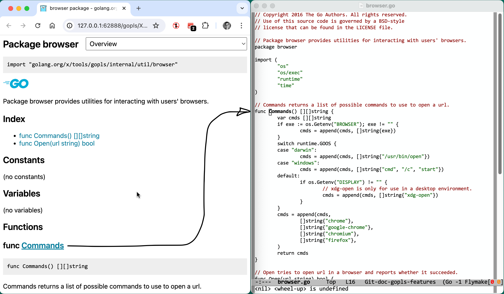
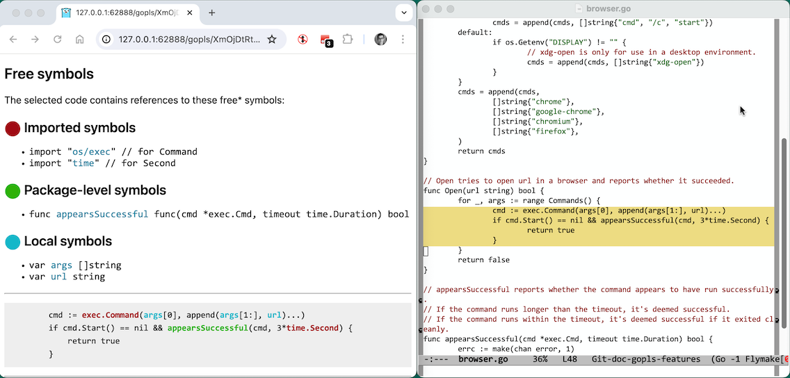
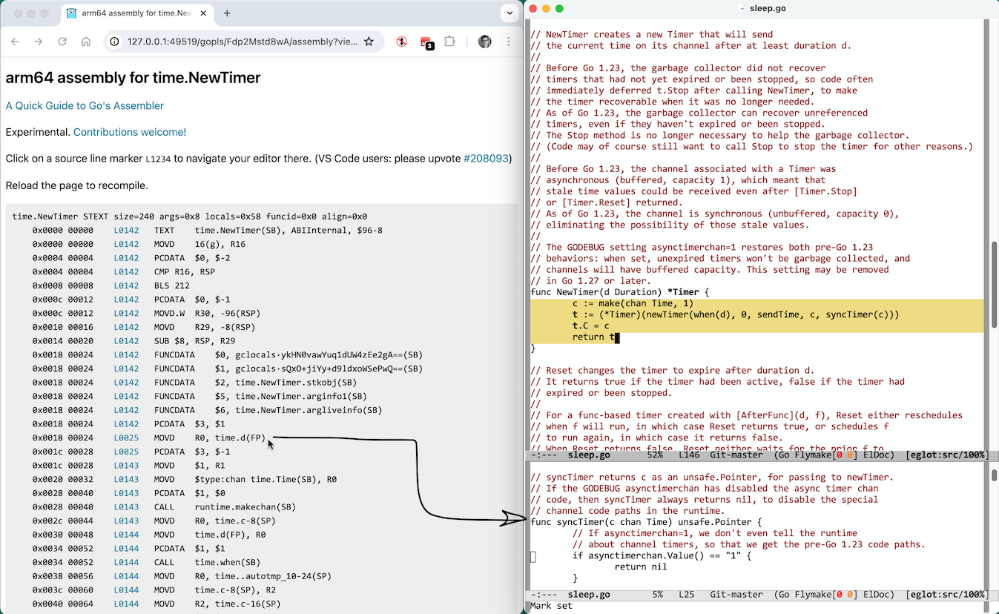

# Gopls: Web-based features

The LSP
[`window.showDocument`](https://microsoft.github.io/language-server-protocol/specifications/lsp/3.17/specification/#window_showDocument) request
allows the server to instruct the client to open a file in the editor
or a web page in a browser. It is the basis for a number of gopls
features that report information about your program through a web
interface.

We recognize that a web interface is not ideal for everyone: some
users prefer a full-screen editor layout and dislike switching
windows; others may work in a text-only terminal without a window
system, perhaps over remote ssh or on the Linux console.
Unfortunately, the LSP lacks several natural kinds of extensibility,
including the ability for servers to define:

- queries that [generalize a References
  query](https://github.com/microsoft/language-server-protocol/issues/1911),
  displaying results using similar UI elements;
- commands that [produce a stream of
  text](https://github.com/joaotavora/eglot/discussions/1402), like a
  typical shell command or compiler, that the client can redirect to
  the editor's usual terminal-like UI element; or
- refactoring operations that, like Rename, [prompt the
  user](https://github.com/microsoft/language-server-protocol/issues/1164)
  for additional information.

The web-based UI can help fill these gaps until such time as the LSP
provides standard ways of implementing these features.

Gopls' web server listens on a `localhost` port. For security, all its
endpoints include a random string that serves as an authentication
token. The client, provided authenticated URLs by the server, will be
able to access your source code, but arbitrary processes running on
your machine will not.
Restarting the gopls process causes this secret to change, rendering
all existing previous URLs invalid; existing pages will display a banner
indicating that they have become disconnected.

TODO: combine the web server and the debug server; see golang/go#68229.

Gopls supports two-way communication between the web browser and the
client editor. All of the web-based reports contain links to
declarations in your source code. Clicking on one of these links
causes gopls to send a `showDocument` request to your editor to open
the relevant source file at the appropriate line. This works even when
your source code has been modified but not saved.
(VS Code users: please upvote microsoft/vscode#208093 if you would
like your editor to raise its window when handling this event.)

## `source.doc`: Browse package documentation

In any Go source file, a code action request returns a command to
"Browse package documentation". This command opens a browser window
showing the documentation for the current Go package, presented using
a similar design to https://pkg.go.dev.

This allows you to preview the documentation for your packages, even
internal ones that may be unpublished externally. Reloading the page
updates the documentation to reflect your changes. It is not necessary
to save modified Go source files.

Clicking on the link for a package-level symbol or method, which in
`pkg.go.dev` would ordinarily take you to a source-code viewer such as
GitHub or Google Code Search, causes your editor to navigate to the
relevant source file and line.

Client support:
- **VS Code**: Use the "Source Action... > Browse documentation for package P" menu.
- **Emacs + eglot**: Use `M-x go-browse-doc` in [go-mode](https://github.com/dominikh/go-mode.el).
- **Vim + coc.nvim**: ??

## `source.freesymbols`: Browse free symbols

When studying code, either to understand it or to evaluate a different
organization or factoring, it is common to need to know what the
"inputs" are to a given chunk of code, either because you are
considering extracting it into its own function and want to know what
parameters it would take, or just to understand how one piece of a long
function relates to the preceding pieces.

If you select a chunk of code, and invoke the "Browse free symbols"
[code action](transformation.md#code-actions), your editor will
open a browser displaying a report on the free symbols of the
selection. A symbol is "free" if it is referenced from within the
selection but defined outside of it. In essence, these are the inputs
to the selected chunk.

The report classifies the symbols into imported, local, and
package-level symbols. The imported symbols are grouped by package,
and link to the documentation for the package, as described above.
Each of the remaining symbols is presented as a link that causes your
editor to navigate to its declaration.

TODO: explain dotted paths.

Client support:
- **VS Code**: Use the "Source Action... > Browse free symbols" menu.
- **Emacs + eglot**: Use `M-x go-browse-freesymbols` in [go-mode](https://github.com/dominikh/go-mode.el).
- **Vim + coc.nvim**: ??

## `source.assembly`: Browse assembly

When you're optimizing the performance of your code or investigating
an unexpected crash, it may sometimes be helpful to inspect the
assembly code produced by the compiler for a given Go function.

If you position the cursor or selection within a function f,
gopls offers the "Browse assembly for f" [code action](transformation.md#code-actions).
This opens a web-based listing of the assembly for the function, plus
any functions nested within it.

Each time you edit your source and reload the page, the current
package is recompiled and the listing is updated. It is not necessary
to save your modified files.

The compiler's target architecture is the same as the one gopls uses
when analyzing the file: typically, this is your machine's GOARCH, but
when viewing a file with a build tag, such as one named `foo_amd64.go`
or containing the comment `//go:build amd64`, the tags determine the
architecture.

Each instruction is displayed with a link that causes your editor to
navigate to the source line responsible for the instruction, according
to the debug information.

The example above shows the arm64 assembly listing of
[`time.NewTimer`](https://pkg.go.dev/time#NewTimer).
Observe that the indicated instruction links to a source location
inside a different function, `syncTimer`, because the compiler
inlined the call from `NewTimer` to `syncTimer`.

Browsing assembly is not yet supported for generic functions, package
initializers (`func init`), or functions in test packages.
(Contributions welcome!)

Client support:
- **VS Code**: Use the "Source Action... > Browse GOARCH assembly for f" menu.
- **Emacs + eglot**: Use `M-x go-browse-assembly` in [go-mode](https://github.com/dominikh/go-mode.el).
- **Vim + coc.nvim**: ??
