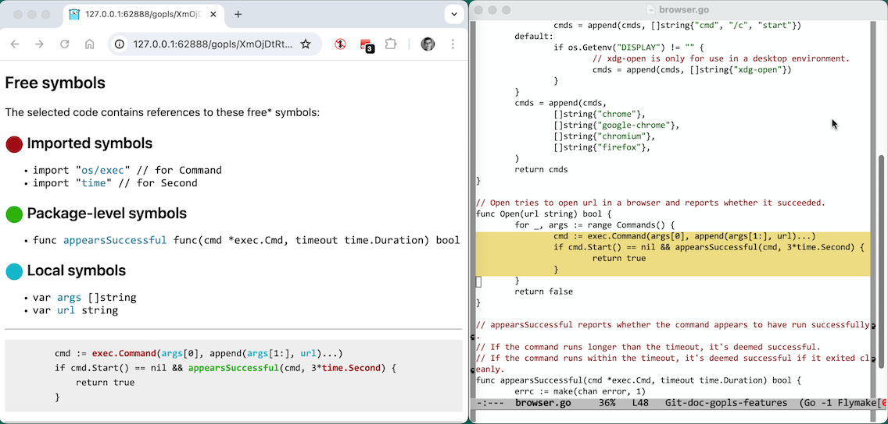
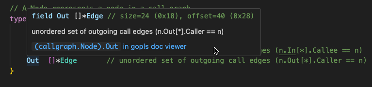
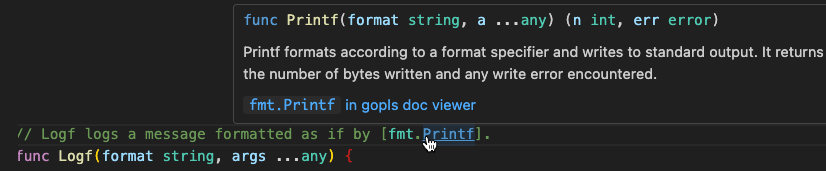

# gopls/v0.16.0

```
go install golang.org/x/tools/gopls@v0.16.2
```

This release includes several features and bug fixes, and is the first
version of gopls to support Go 1.23. To install it, run:

## New support policy; end of support for Go 1.19 and Go 1.20

**TL;DR: We are narrowing gopls' support window, but this is unlikely to
affect you as long as you use at least Go 1.21 to build gopls. This doesn't
affect gopls' support for the code you are writing.**

This is the last release of gopls that may be built with Go 1.19 or Go 1.20,
and also the last to support integrating with go command versions 1.19 and
1.20. If built or used with either of these Go versions, it will display
a message advising the user to upgrade.

When using gopls, there are three versions to be aware of:

1. The _gopls build go version_: the version of Go used to build gopls.
2. The _go command version_: the version of the go list command executed by
   gopls to load information about your workspace.
3. The _language version_: the version in the go directive of the current
   file's enclosing go.mod file, which determines the file's Go language
   semantics.

This gopls release, v0.16.0, is the final release to support Go 1.19 and Go
1.20 as the _gopls build go version_ or _go command version_. There is no
change to gopls' support for all _language versions_--in fact this support has
somewhat improved with the addition of the `stdversion` analyzer (see below).

Starting with gopls@v0.17.0, which will be released after Go 1.23.0 is released
in August, gopls will only support the latest version of Go as the
_gopls build go version_.
However, thanks to the [forward compatibility](https://go.dev/blog/toolchain)
added to Go 1.21, any necessary toolchain upgrade should be handled
automatically for users of Go 1.21 or later, just like any other dependency.
Additionally, we are reducing our _go command version_ support window from
4 versions to 3. Note that this means if you have at least Go 1.21 installed on
your system, you should still be able to `go install` and use gopls@v0.17.0.

We have no plans to ever change our _language version_ support: we expect that
gopls will always support developing programs that target _any_ Go version.

By focusing on building gopls with the latest Go version, we can significantly
reduce our maintenance burden and help improve the stability of future gopls
releases. See the newly updated
[support policy](https://github.com/golang/tools/tree/master/gopls#support-policy)
for details. Please comment on golang/go#65917 if
you have concerns about this change.

## Configuration changes

- The experimental `allowImplicitNetworkAccess` setting is deprecated (but not
  yet removed). Please comment on golang/go#66861 if you use this
  setting and would be impacted by its removal.

## New features

### Go 1.23 support

This version of gopls is the first to support the new language features of Go 1.23,
including
[range-over-func](https://go.dev/wiki/RangefuncExperiment) iterators
and support for the
[`godebug` directive](https://go.dev/ref/mod#go-mod-file-godebug)
in go.mod files.

### Integrated documentation viewer

Gopls now offers a "Browse documentation" code action that opens a
local web page displaying the generated documentation for Go packages
and symbols in a form similar to https://pkg.go.dev.
The package or symbol is chosen based on the current selection.

Use this feature to preview the marked-up documentation as you prepare API
changes, or to read the documentation for locally edited packages,
even ones that have not yet been saved. Reload the page after an edit
to see updated documentation.


As in `pkg.go.dev`, the heading for each symbol contains a link to the
source code of its declaration. In `pkg.go.dev`, these links would refer
to a source code page on a site such as GitHub or Google Code Search.
However, in gopls' internal viewer, clicking on one of these links will
cause your editor to navigate to the declaration.
(This feature requires that your LSP client honors the `showDocument` downcall.)


Editor support:

- VS Code: use the "Source action > Browse documentation for func fmt.Println" menu item.
  Note: source links navigate the editor but don't yet raise the window yet.
  Please upvote microsoft/vscode#208093 and microsoft/vscode#207634 (temporarily closed).
- Emacs: requires eglot v1.17. Use `M-x go-browse-doc` from github.com/dominikh/go-mode.el.

The `linksInHover` setting now supports a new value, `"gopls"`,
that causes documentation links in the the Markdown output
of the Hover operation to link to gopls' internal doc viewer.

### Browse free symbols

Gopls offers another web-based code action, "Browse free symbols",
which displays the free symbols referenced by the selected code.

A symbol is "free" if it is referenced within the selection but
declared outside of it. The free symbols that are variables are
approximately the set of parameters that would be needed if the block
were extracted into its own function.

Even when you don't intend to extract a block into a new function,
this information can help you to tell at a glance what names a block
of code depends on.

Each dotted path of identifiers (such as `file.Name.Pos`) is reported
as a separate item, so that you can see which parts of a complex
type are actually needed.

The free symbols of the body of a function may reveal that
only a small part (a single field of a struct, say) of one of the
function's parameters is used, allowing you to simplify and generalize
the function by choosing a different type for that parameter.



Editor support:

- VS Code: use the `Source action > Browse free symbols` menu item.
- Emacs: requires eglot v1.17. Use `M-x go-browse-freesymbols` from github.com/dominikh/go-mode.el.

### Browse assembly

Gopls offers a third web-based code action, "Browse assembly for f",
which displays an assembly listing of the declaration of the function
f enclosing the selected code, plus any nested functions such as
function literals or deferred calls.

Gopls invokes the compiler to generate the report;
reloading the page updates the report.

The machine architecture is determined by the build
configuration that gopls selects for the current file.
This is usually the same as your machine's GOARCH unless you are
working in a file with `go:build` tags for a different architecture.


Gopls cannot yet display assembly for generic functions:
generic functions are not fully compiled until they are instantiated,
but any function declaration enclosing the selection cannot be an
instantiated generic function.

<!-- Clearly the ideal UX for generic functions is to use the function
     symbol under the cursor, e.g. Vector[string], rather than the
     enclosing function; but computing the name of the linker symbol
     remains a challenge. -->

Editor support:

- VS Code: use the "Source action > Browse assembly for f" menu item.
- Emacs: requires eglot v1.17. Use `M-x go-browse-assembly` from github.com/dominikh/go-mode.el.

### `unusedwrite` analyzer

The new
[unusedwrite](https://pkg.go.dev/golang.org/x/tools/go/analysis/passes/unusedwrite)
analyzer reports assignments, often to fields of structs, that have no
effect because, for example, the struct is never used again:

```go
func scheme(host string) string {
	u := &url.URL{
		Host:   host, // "unused write to field Host" (no need to construct a URL)
		Scheme: "https:",
	}
	return u.Scheme
}
```

This is at best an indication that the code is unnecessarily complex
(for instance, some dead code could be removed), but often indicates a
bug, as in this example:

```go
type S struct { x int }

func (s S) set(x int) {
	s.x = x // "unused write to field x" (s should be a *S pointer)
}
```

### `stdversion` analyzer

The new
[`stdversion`](https://pkg.go.dev/golang.org/x/tools/go/analysis/passes/stdversion)
analyzer warns about the use of too-new standard library symbols based on the
version of the `go` directive in your `go.mod` file. This improves our support
for older _language versions_ (see above), even when gopls is built with
a recent Go version.

Consider the go.mod file and Go file below.
The declaration of `var `alias refers to a type, `types.Alias`,
introduced in go1.22, but the file belongs to a module that requires
only go1.21, so the analyzer reports a diagnostic:

```
module example.com
go 1.21
```

```go
package p

import "go/types"

var alias types.Alias // types.Alias requires go1.22 or later (module is go1.21)
```

When an individual file is build-tagged for a release of Go other than
than module's version, the analyzer will apply appropriate checks for
the file's version.

### Two more vet analyzers

The [framepointer](https://pkg.go.dev/golang.org/x/tools/go/analysis/passes/framepointer)
and [sigchanyzer](https://pkg.go.dev/golang.org/x/tools/go/analysis/passes/sigchanyzer)
analyzers have long been part of go vet's suite,
but had been overlooked in previous versions of gopls.

Henceforth, gopls will always include any analyzers run by vet.

### Hover shows size/offset info, and struct tags

Hovering over the identifier that declares a type or struct field now
displays the size information for the type:


and the offset information for the field:



In addition, it reports the percentage of wasted space due to
suboptimal ordering of struct fields, if this figure is 20% or higher:


In the struct above, alignment rules require each of the two boolean
fields (1 byte) to occupy a complete word (8 bytes), leading to (7 + 7) / (3 \* 8) = 58% waste.
Placing the two booleans together would save a word.

This information may be helpful when making space optimizations to
your data structures, or when reading assembly code.

Also, hovering over a reference to a field with a struct tag now also
display the tag:


### Hover and "Go to Definition" work on symbols in doc comments

Go 1.19 added support for [doc links](https://go.dev/doc/comment#links),
allowing the doc comment for one symbol to reference another.

Gopls' Hover and Definition operations now treat these links just
like identifiers, so hovering over one will display information about
the symbol:



Similarly, "Go to definition" will navigate to its declaration.
Thanks to @rogeryk for contributing this feature.

## Bugs fixed

## Thank you to our contributors!

@guodongli-google for the `unusedwrite` analyzer.
TODO: they're a xoogler; is there a more current GH account?

@rogeryk
