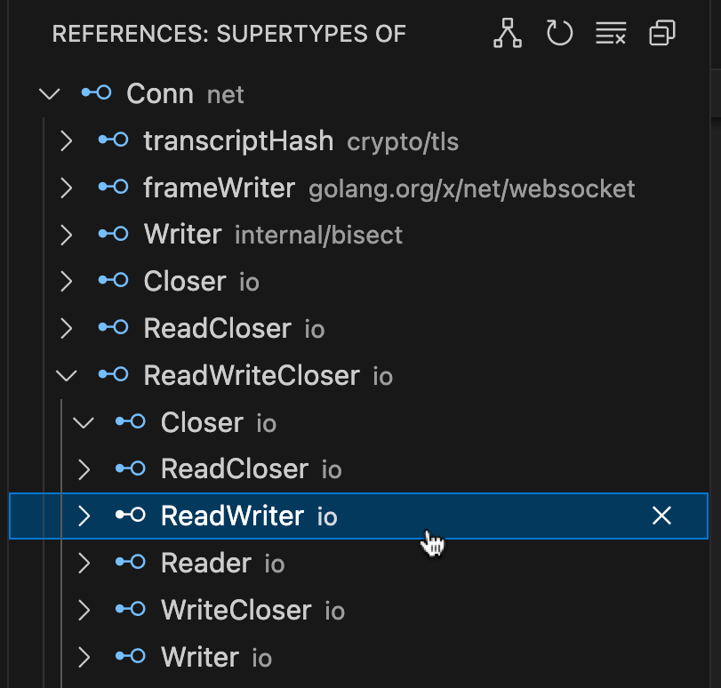
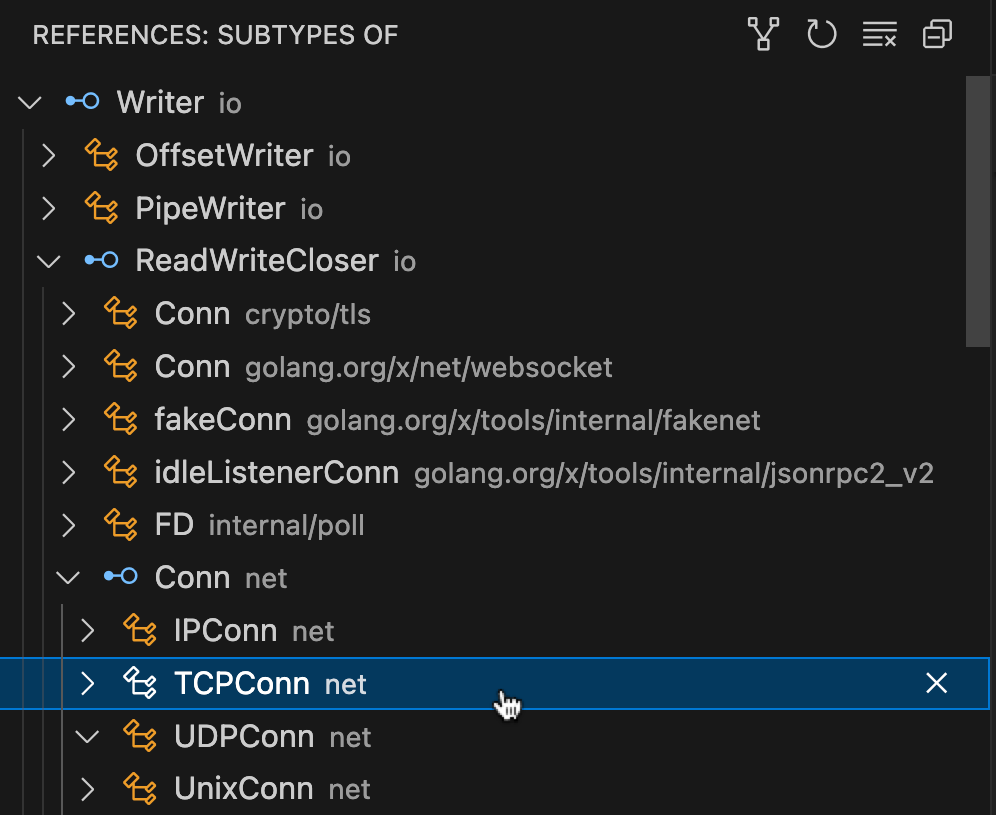

## Configuration Changes

- The `gopls check` subcommand now accepts a `-severity` flag to set a minimum
  severity for the diagnostics it reports. By default, the minimum severity
  is "warning", so `gopls check` may report fewer diagnostics than before. Set
  `-severity=hint` to reproduce the previous behavior.

## Navigation features

### "Implementations" supports signature types (within same package)

<!-- golang/go#56572 -->

The Implementations query reports the correspondence between abstract
and concrete types and their methods based on their method sets.
Now, it also reports the correspondence between function types,
dynamic function calls, and function definitions, based on their signatures.

To use it, invoke an Implementations query on the `func` token of the
definition of a named function, named method, or function literal.
Gopls reports the set of function signature types that abstract this
function, and the set of dynamic calls through values of such types.

Conversely, an Implementations query on the `func` token of a
signature type, or on the `(` paren of a dynamic function call,
reports the set of concrete functions that the signature abstracts
or that the call dispatches to.

Since a type may be both a function type and a named type with methods
(for example, `http.HandlerFunc`), it may participate in both kinds of
Implements queries (method-sets and function signatures).
Queries using method-sets should be invoked on the type or method name,
and queries using signatures should be invoked on a `func` or `(` token.

Only the local (same-package) algorithm is currently supported.
(https://go.dev/issue/56572 tracks the global algorithm.)

### "Go to Implementation" reports interface-to-interface relations

<!-- golang/go#68641 -->

The "Go to Implementation" operation now reports relationships between
interfaces. Gopls now uses the concreteness of the query type to
determine whether a query is "downwards" (from an interface to the
types that implement it) or "upwards" (from a concrete type to the
interfaces to which it may be assigned). So, for example:

- `implementation(io.Reader)` subinterfaces such as `io.ReadCloser`,
  and concrete implementations such as `*os.File`.

- `implementation(os.File)` includes only interfaces, such as
  `io.Reader` and `io.ReadCloser`.

To request an "upwards" query starting from an interface, for example
to find the superinterfaces of `io.ReadCloser`, use the Type Hierarchy
feature described below.
(See https://github.com/microsoft/language-server-protocol/issues/2037.)

### Support for Type Hierarchy

<!-- golang/go#72142 -->

Gopls now implements the three LSP methods related to the Type
Hierarchy viewer: `textDocument/prepareTypeHierarchy`,
`typeHierarchy/supertypes`, `typeHierarchy/subtypes`.

In VS Code, select "Show Type Hierarchy" from the context menu
to see a tree widget displaying all the supertypes or subtypes
of the selected named type.






## Editing features

### Completion: auto-complete package clause for new Go files

Gopls now automatically adds the appropriate `package` clause to newly created Go files,
so that you can immediately get started writing the interesting part.

It requires client support for `workspace/didCreateFiles`

### New GOMODCACHE index for faster Organize Imports and unimported completions

By default, gopls now builds and maintains a persistent index of
packages in the module cache (GOMODCACHE). The operations of Organize
Imports and completion of symbols from unimported pacakges are an
order of magnitude faster.

To revert to the old behavior, set the `importsSource` option (whose
new default is `"gopls"`) to `"goimports"`. Users who don't want the
module cache used at all for imports or completions can change the
option to "off".

## Analysis features

### Most `staticcheck` analyzers are enabled by default

Slightly more than half of the analyzers in the
[Staticcheck](https://staticcheck.dev/docs/checks) suite are now
enabled by default. This subset has been chosen for precision and
efficiency.

Previously, Staticcheck analyzers (all of them) would be run only if
the experimental `staticcheck` boolean option was set to `true`. This
value continues to enable the complete set, and a value of `false`
continues to disable the complete set. Leaving the option unspecified
enables the preferred subset of analyzers.

Staticcheck analyzers, like all other analyzers, can be explicitly
enabled or disabled using the `analyzers` configuration setting; this
setting now takes precedence over the `staticcheck` setting, so,
regardless of what value of `staticcheck` you use (true/false/unset),
you can make adjustments to your preferred set of analyzers.

### `recursiveiter`: "inefficient recursive iterator"

A common pitfall when writing a function that returns an iterator
(`iter.Seq`) for a recursive data type is to recursively call the
function from its own implementation, leading to a stack of nested
coroutines, which is inefficient.

The new `recursiveiter` analyzer detects such mistakes; see
[its documentation](https://golang.org/x/tools/gopls/internal/analysis/recursiveiter)
for details, including tips on how to define simple and efficient
recursive iterators.

### `maprange`: "inefficient range over maps.Keys/Values"

The new `maprange` analyzer detects redundant calls to `maps.Keys` or
`maps.Values` as the operand of a range loop; maps can of course be
ranged over directly. See
[its documentation](https://pkg.go.dev/golang.org/x/tools/gopls/internal/analysis/maprange)
for details).

## Code transformation features

### Rename method receivers

<!-- golang/go#41892 -->

The Rename operation, when applied to the declaration of a method
receiver, now also attempts to rename the receivers of all other
methods associated with the same named type. Each other receiver that
cannot be fully renamed is quietly skipped.

Renaming a _use_ of a method receiver continues to affect only that
variable.

```go
type Counter struct { x int }

                 Rename here to affect only this method
                          ↓
func (c *Counter) Inc() { c.x++ }
func (c *Counter) Dec() { c.x++ }
      ↑
  Rename here to affect all methods
```

### "Eliminate dot import" code action

<!-- golang/go#70319 -->

This code action, available on a dotted import, will offer to replace
the import with a regular one and qualify each use of the package
with its name.

### Add/remove tags from struct fields

Gopls now provides two new code actions, available on an entire struct
or some of its fields, that allow you to add and remove struct tags.
It adds only 'json' tags with a snakecase naming format, or clears all
tags within the selection.

Add tags example:
```go
type Info struct {
    LinkTarget string        ->      LinkTarget string `json:"link_target"`
    ...
}
```

### Inline local variable

<!-- golang/go#70085 -->

The new `refactor.inline.variable` code action replaces a reference to
a local variable by that variable's initializer expression. For
example, when applied to `s` in `println(s)`:

```go
func f(x int) {
	s := fmt.Sprintf("+%d", x)
	println(s)
}
```
it transforms the code to:
```go
func f(x int) {
	s := fmt.Sprintf("+%d", x)
	println(fmt.Sprintf("+%d", x))
}
```

Only a single reference is replaced; issue https://go.dev/issue/70085
tracks the feature to "inline all" uses of the variable and eliminate
it.


## Thank you to our contributors!

[@acehinnnqru](https://github.com/acehinnnqru)
[@adonovan](https://github.com/adonovan)
[@albfan](https://github.com/albfan)
[@aarzilli](https://github.com/aarzilli)
[@ashurbekovz](https://github.com/ashurbekovz)
[@cuonglm](https://github.com/cuonglm)
[@dmitshur](https://github.com/dmitshur)
[@neild](https://github.com/neild)
[@egonelbre](https://github.com/egonelbre)
[@shashank](https://github.com/shashank)
[priyadarshi](https://github.compriyadarshi)
[@firelizzard18](https://github.com/firelizzard18)
[@gopherbot](https://github.com/gopherbot)
[@h9jiang](https://github.com/h9jiang)
[@cuishuang](https://github.com/cuishuang)
[@jakebailey](https://github.com/jakebailey)
[@jba](https://github.com/jba)
[@madelinekalil](https://github.com/madelinekalil)
[@karamaru](https://github.com/karamaru)
[alpha](https://github.comalpha)
[@danztran](https://github.com/danztran)
[@nsrip](https://github.com/nsrip)
[dd](https://github.comdd)
[@pjweinb](https://github.com/pjweinb)
[@findleyr](https://github.com/findleyr)
[@samthanawalla](https://github.com/samthanawalla)
[@seankhliao](https://github.com/seankhliao)
[@tklauser](https://github.com/tklauser)
[@vikblom](https://github.com/vikblom)
[@kwjw](https://github.com/kwjw)
[@xieyuschen](https://github.com/xieyuschen)
