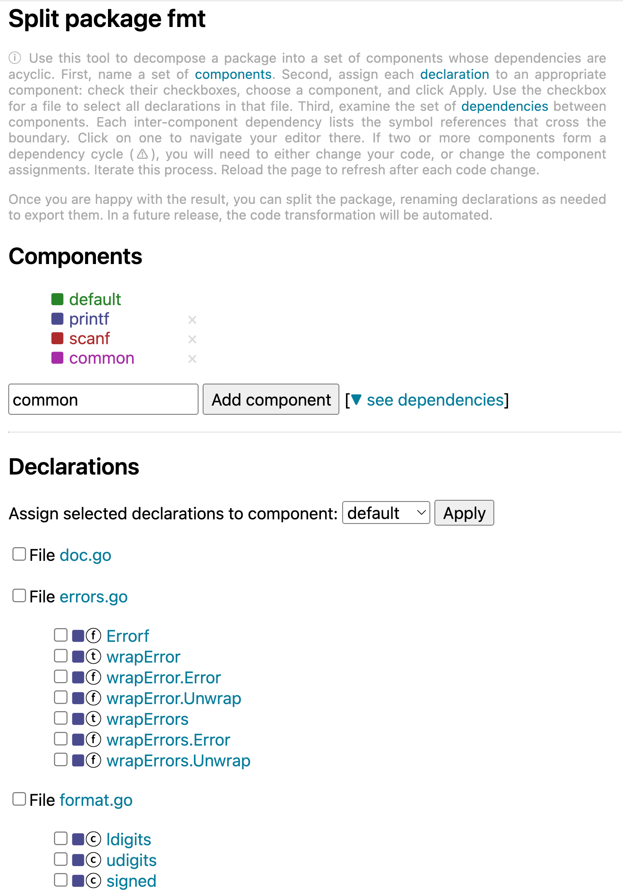

This release contains a new experimental Model Context Protocol (MCP)
server for gopls, which may be used to integrate a subset of gopls'
features in AI-assisted environments.

Gopls' documentation is now available on the Go project's website at
https://go.dev/gopls. (This link reflects the latest gopls release;
use https://tip.golang.org/gopls to see docs for the latest commit.)
Unlike Markdown files in GitHub, these pages are crawled by Google's
web search index.

## Configuration changes

This release enables by default the new persistent index of packages
in the module cache. This was first attempted in [v0.19](./v0.19.0.md) but reverted
due to problems that have since been fixed.

## Web-based features

### "Split package" tool

The `source.splitPackage` code action opens a web-based tool that
helps you split a package into two or more components whose
dependencies are acyclic.

To use it, name a set of components, assign each declaration to a
component, then visualize the dependencies among the components
(including whether they form a cycle).
Refresh the page each time you edit your code to see the latest
information.

<p align="center"></p>

The tool makes it easy to iterate over potential decompositions
until you find one you are happy with. A future version of
the tool will automate the code transformation, but for now
you must do that step by hand.


## Editing features

### Model Context Protocol server

Gopls now includes an experimental built-in server for the Model Context
Protocol (MCP), allowing it to expose a subset of its functionality to
AI assistants in the form of MCP tools.

See the [documentation](../features/mcp.md) for more information.

**Caveats:** This is a brand new mode of operation for gopls, and so we're
still experimenting with the best set of tools and instructions to provide.
Please let us know how well it works for you. Also, please be aware that
allowing LLMs to execute operations in your workspace entails additional
security considerations, as discussed in the documentation above.

## Analysis features

### `ignoredError` inlay hint

The new `ignoredError` inlay hint helps catch mistakenly discarded
errors. It inserts an `// ignore error` hint following any statement
that is a function call whose error result is implicitly ignored. For
example, this code:

```go
f.Close()
```
will appear as:
```go
f.Close() // ignore error
```

To suppress the hint, write an actual comment containing `ignore
error` following the call statement, or explictly assign the result
to a blank `_` variable. A handful of common functions such as
`fmt.Println` are excluded from the check.

Enable it using this configuration: `{"hints": {"ignoredError": true}}`.

### `unusedfunc` reports unused `type`, `var`, and `const` declarations too

<!-- golang/go#40862 -->

The
[unusedfunc](https://pkg.go.dev/golang.org/x/tools/gopls/internal/analysis/unusedfunc/)
analyzer now reports any unexported types, variables, and constants
that are unreferenced within their declaring package.
(The problem of unreferenced exported symbols can't be expressed in
the analysis framework since it depends on the entire workspace.)

## Code transformation features

<!-- golang/go#45199 -->
The Rename operation now allows you to rename an embedded field, such
as T in `struct{ T }`, so long as the operation is requested at the
field declaration (T). Both the field and its type will be renamed.
