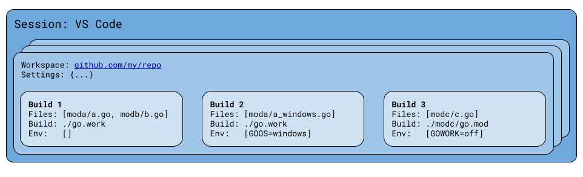

# Setting up your workspace

In the language server protocol, a "workspace" consists of a folder along with
per-folder configuration. Some LSP clients such as VS Code allow configuring
workspaces explicitly, while others do so automatically by looking for special
files defining a workspace root (such as a `.git` directory or `go.mod` file).

In order to function, gopls needs a defined scope in which language features
like references, rename, and implementation should operate. Put differently,
gopls needs to infer from the LSP workspace which  `go build` invocations you
would use to build your workspace, including the working directory,
environment, and build flags.

In the past, it could be tricky to set up your workspace so that gopls would
infer the correct build information. It required opening the correct directory
or using a `go.work` file to tell gopls about the modules you're working on,
and configuring the correct operating system and architecture in advance.
When this didn't work as expected, gopls would often fail in mysterious
ways--the dreaded "No packages found" error.

Starting with gopls v0.15.0, workspace configuration is much simpler, and gopls
will typically work when you open a Go file anywhere in your workspace. If it
isn't working for you, or if you want to better understand how gopls models
your workspace, please read on.

## Workspace builds

Starting with gopls v0.15.0, gopls will guess the builds you are working on
based on the set of open files. When you open a file in a workspace folder,
gopls checks whether the file is contained in a module, `go.work` workspace, or
GOPATH directory, and configures the build accordingly. Additionally, if you
open a file that is constrained to a different operating system or
architecture, for example opening `foo_windows.go` when working on Linux, gopls
will create a scope with `GOOS` and `GOARCH` set to a value that matches the
file.

For example, suppose we had a repository with three modules: `moda`, `modb`,
and `modc`, and a `go.work` file using modules `moda` and `modb`. If we open
the files `moda/a.go`, `modb/b.go`, `moda/a_windows.go`, and `modc/c.go`, gopls
will automatically create three builds:



This allows gopls to _just work_ when you open a Go file, but it does come with
several caveats:

- It causes gopls to do more work, since it is now tracking three builds
  instead of one. However, the recent
  [scalability redesign](https://go.dev/blog/gopls-scalability)
  allows much of this work to be avoided through efficient caching.
- For operations invoked from a given file, such as "References"
  or "Implementations", gopls executes the operation in
  _the default build for that file_. For example, finding references to
  a symbol `S` from `foo_linux.go` will return references from the Linux build,
  and finding references to the same symbol `S` from `foo_windows.go` will
  return references from the Windows build. Gopls searches the default build
  for the file, but it doesn't search all the other possible builds (even
  though that would be nice) because it is liable to be too expensive.
  Issues [#65757](https://go.dev/issue/65757) and
  [#65755](https://go.dev/issue/65755) propose improvements to this behavior.
- When selecting a `GOOS/GOARCH` combination to match a build-constrained file,
  gopls will choose the first matching combination from
  [this list](https://cs.opensource.google/go/x/tools/+/master:gopls/internal/cache/port.go;l=30;drc=f872b3d6f05822d290bc7bdd29db090fd9d89f5c).
  In some cases, that may be surprising.
- When working in a `GOOS/GOARCH` constrained file that does not match your
  default toolchain, `CGO_ENABLED=0` is implicitly set, since a C toolchain for
  that target is unlikely to be available. This means that gopls will not
  work in files including `import "C"`. Issue
  [#65758](https://go.dev/issue/65758) may lead to improvements in this
  behavior.
- Gopls is currently unable to guess build flags that include arbitrary
  user-defined build constraints, such as a file with the build directive
  `//go:build mytag`. Issue [#65089](https://go.dev/issue/65089) proposes
  a heuristic by which gopls could handle this automatically.

Please provide feedback on this behavior by upvoting or commenting the issues
mentioned above, or opening a [new issue](https://go.dev/issue/new) for other
improvements you'd like to see.

## When to use a `go.work` file for development

Starting with Go 1.18, the `go` command has built-in support for multi-module
workspaces specified by [`go.work`](https://go.dev/ref/mod#workspaces) files.
Gopls will recognize these files if they are present in your workspace.

Use a `go.work` file when:

- you want to work on multiple modules simultaneously in a single logical
  build, for example if you want changes to one module to be reflected in
  another.
- you want to improve gopls' memory usage or performance by reducing the number
  of builds it must track.
- you want gopls to know which modules you are working on in a multi-module
  workspace, without opening any files. For example, it may be convenient to use
  `workspace/symbol` queries before any files are open.
- you are using gopls v0.14.2 or earlier, and want to work on multiple
  modules.

For example, suppose this repo is checked out into the `$WORK/tools` directory,
and [`x/mod`](https://pkg.go.dev/golang.org/x/mod) is checked out into
`$WORK/mod`, and you are working on a new `x/mod` API for editing `go.mod`
files that you want to simultaneously integrate into gopls.

You can work on both `golang.org/x/tools/gopls` and `golang.org/x/mod`
simultaneously by creating a `go.work` file:

```sh
cd $WORK
go work init
go work use tools/gopls mod
```

then opening the `$WORK` directory in your editor.

## When to manually configure `GOOS`, `GOARCH`, or `-tags`

As described in the first section, gopls v0.15.0 and later will try to
configure a new build scope automatically when you open a file that doesn't
match the system default operating system (`GOOS`) or architecture (`GOARCH`).

However, per the caveats listed in that section, this automatic behavior comes
with limitations. Customize your gopls environment by setting `GOOS` or
`GOARCH` in your
[`"build.env"`](https://github.com/golang/tools/blob/master/gopls/doc/settings.md#env)
or `-tags=...` in your"
["build.buildFlags"](https://github.com/golang/tools/blob/master/gopls/doc/settings.md#buildflags)
when:

- You want to modify the default build environment.
- Gopls is not guessing the `GOOS/GOARCH` combination you want to use for
  cross platform development.
- You need to work on a file that is constrained by a user-defined build tags,
  such as the build directive `//go:build mytag`.

## GOPATH mode

When opening a directory within a `GOPATH` directory, the workspace scope will
be just that directory and all directories contained within it. Note that
opening a large GOPATH directory can make gopls very slow to start.
